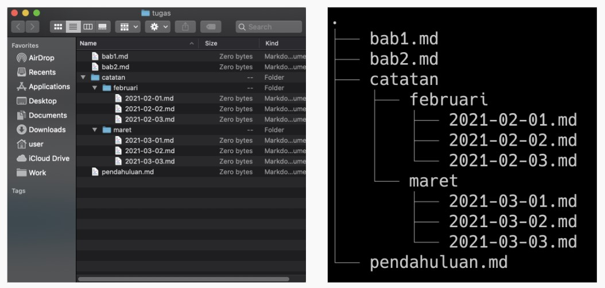

# <p style="text-align: center;">```Writing and Presentation Test Week 1 ```</p>

---

# Stage 0 Intro To Coding

    
# Stage 1 Web Development Pemula

## Unix Command Line
`pengenalan Unix Command Line`
### Command Line Interface (CLI)
CLI adalah program yang memungkinkan pengguna mengetik perintah teks yang memerintahkan komputer untuk melakukan tugas tertentu
### Shell 
- **Shell** adalah Program untuk berkomunikasi dengan sistem operasi
- Shell yang berbasis teks disebut Command Line Interface
### CLI terminal
- Terminal Emulator, aplikasi untuk mengakses CLI
- contoh CLI
    - Bash
    - PowerShell
    - sh
    - cmd.exe
- Shell Prompt adalah Tempat kita memasukkan command
### file system
Sebuah filesystem mengatur bagaimana data disimpan di dalam sebuah system

> contoh file system structure
> 

`command command Unix`
- Struktur Penulisan Command
```
$ command -options argument
```
- Command-command CLI
    - #### clear / ctrl + l<br>
        untuk membersihkan terminal
        ```
        $ clear
        ```
    - #### mkdir<br>
        membuat directory baru
        ```
        $ mkdir <nama_dir>
        ```
    - #### cd<br>
        ```
        $ cd ../directory
        ```
        > catatan : .. untuk naik 1 directory
    - #### pwd<br>
        melihat lokasi directory saat ini
        ```
        $ pwd
        ```
    - #### ls<br>
        menampilkan semua file
        ```
        $ ls
        ```
        menampilkan semua file beserta hidden file
        ```
        $ ls -a
        ```
    - #### man<br>
        untuk melihat penjelasan dan penggunaan dari suatu command 
        ```
        $ man <nama_command>
        ```
    - #### touch<br>
        untuk membuat file
        ```
        $ touch <nama_file>
        ```
    - #### cp<br>
        untuk mengcopy file dalam directory yang sama
        ```
        $ cp <nama_file> <new_nama_file>
        ```
        copy ke dir spesifik
        ```
        $ cp <nama_file1> <nama_file2> <destination_dir>
        ```
        copy directory beserta isinya secara rekursif ke dalam directory yang dituju
        ```
        $ cp -r/R Src_directory Dest_directory
        ```
    - #### mv<br>
        rename file
        ```
        $ mv <nama_file> <nama_file_baru>
        ```
        memindahkan file
        ```
        $ mv <nama file> <directory>
        ```
    - #### rm<br>
        Remove file
        ```
        $ rm <file>
        ```
        remove directory
        ```
        $ rm -r <directory>
        ```
    - #### echo
        Cetak sesuatu
        ```
        $ print -option "<something>"
        ```
    - #### cat
        
    - #### nano
        untuk membuka editor teks untuk file
        ```
        nano <file_name>
        ```
