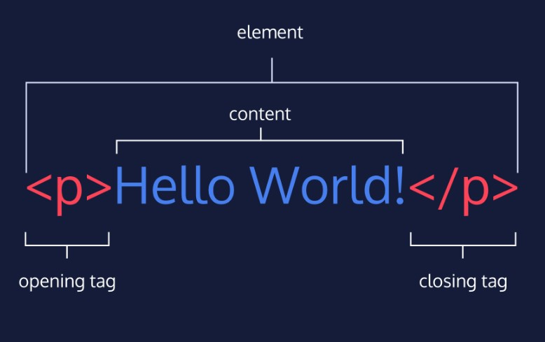
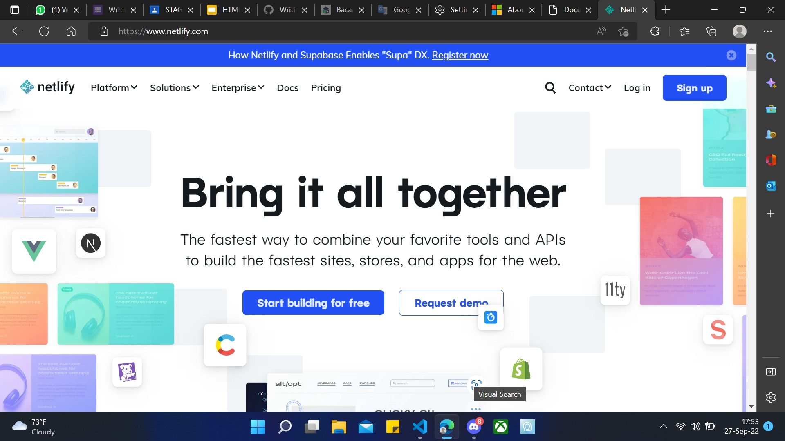
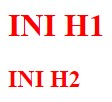
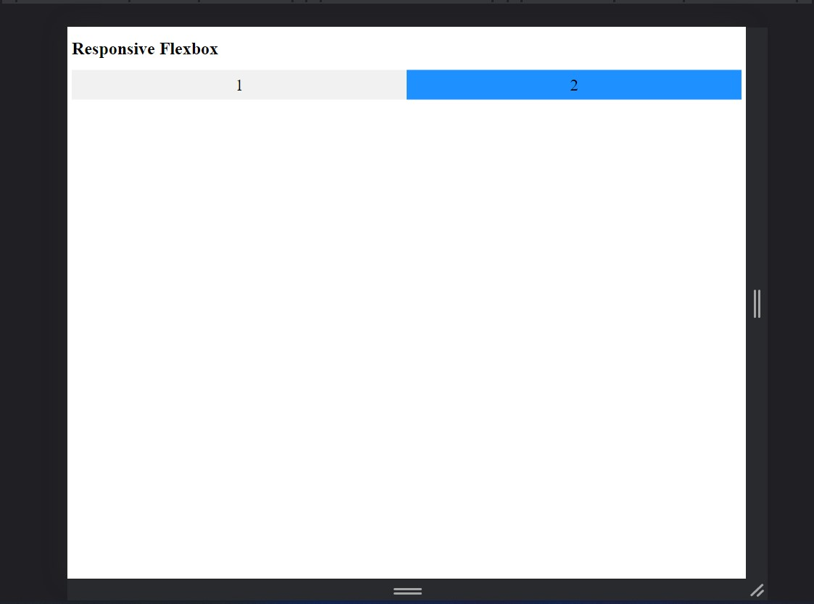
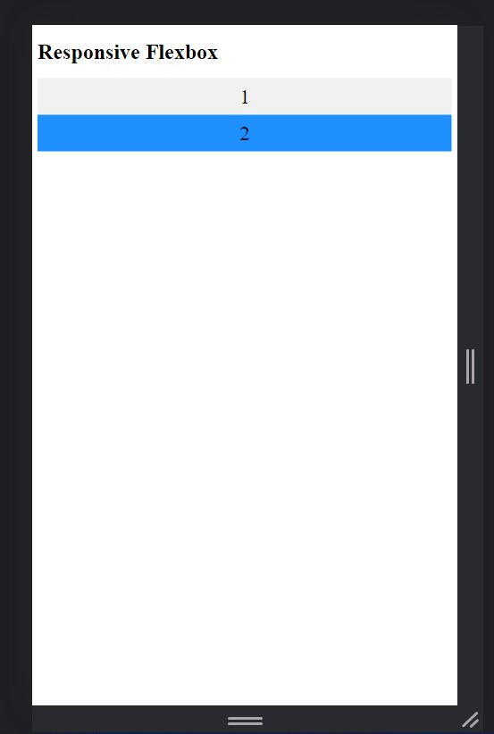

# <p style="text-align: center;">`Writing and Presentation Test Week 1 `</p>

---

# Stage 0 Intro To Coding

# Stage 1 Web Development Pemula

## 1. Unix Command Line

## `pengenalan Unix Command Line`

### Command Line Interface (CLI)

CLI adalah program yang memungkinkan pengguna mengetik perintah teks yang memerintahkan komputer untuk melakukan tugas tertentu

### Shell

- **Shell** adalah Program untuk berkomunikasi dengan sistem operasi
- Shell yang berbasis teks disebut Command Line Interface

### CLI terminal

- Terminal Emulator, aplikasi untuk mengakses CLI
- contoh CLI
- Bash
- PowerShell
- sh
- cmd.exe
- Shell Prompt adalah Tempat kita memasukkan command

### file system

Sebuah filesystem mengatur bagaimana data disimpan di dalam sebuah system

> contoh file system structure
> 

## `command command Unix`

### Struktur Penulisan Command

```
$ command -options argument
```

### Command-command CLI

- #### clear / ctrl + l<br>
  untuk membersihkan terminal

```
$ clear
```

- #### man<br>
  untuk melihat penjelasan dan penggunaan dari suatu command

```
$ man <nama_command>
```

- #### echo
  Cetak sesuatu

```
$ echo -option "<something>"
```

### `Navigasi menggunakan CLI`

- #### pwd<br>
  melihat lokasi directory saat ini

```
$ pwd
```

- #### ls<br>
  menampilkan semua file

```
$ ls
```

menampilkan semua file beserta hidden file

```
$ ls -a
```

- #### cd<br>

```
$ cd ../directory
```

> catatan : ( cd .. ) untuk naik 1 directory

### `Membuat file dan directory`

- #### touch<br>
  untuk membuat file

```
$ touch <nama_file>
```

- #### mkdir<br>
  membuat directory baru

```
$ mkdir <nama_dir>
```

### `Melihat isi file`

- #### head<br>
  menampilkan beberapa baris awal sebuah file text

```
$ head -n <namafile>
```

> -n/-angka untuk banyaknya baris yang ingin ditampilkan

- #### tail<br>
  menampilkan beberapa baris akhir sebuah file text

```
$ tail -n <namafile>
```

> -n/-angka untuk banyaknya baris yang ingin ditampilkan

- #### cat
  melihat seluruh isi sebuah file text

```
$ cat <nama_file>
```

### `Menyalin, memindahkan, menghapus, mengedit, dan files & directory`

- #### cp<br>
  untuk mengcopy file dalam directory yang sama

```
$ cp <nama_file> <new_nama_file>
```

copy ke dir spesifik

```
$ cp <nama_file1> <nama_file2> <destination_dir>
```

copy directory beserta isinya secara rekursif ke dalam directory yang dituju

```
$ cp -r/R Src_directory Dest_directory
```

- #### mv<br>
  rename file

```
$ mv <nama_file> <nama_file_baru>
```

memindahkan file

```
$ mv <nama file> <directory>
```

- #### rm<br>
  Remove file

```
$ rm <file>
```

remove directory

```
$ rm -r <directory>
```

- #### nano
  untuk membuka editor teks untuk file untuk diedit

```
nano <file_name>
```

---

---

## 2. Git dan Github

## `Pengenalan Git`

Git adalah aplikasi yang dapat melacak setiap perubahan yang terjadi pada suatu folder atau file.

## `Instalasi Git`

Download dan install GIT seperti halnya instal aplikasi pada umumnya
[disini](https://git-scm.com 'https://git-scm.com/')

### Setup Awal

```
$ git config --global user.name "John Doe"
$ git config --global user.email johndoe@example.com
```

> WARNING: email yang disetup HARUS SAMA dengan yang digunakan pada GITHUB

### cek setup apakah berhasil

```
$ git config --list
```

## `Repository Git`

Repository adalah direktori proyek yang kita buat

- #### git init<br>

```
$ git init <nama_folder_repository>
```

atau gunakan

```
$ git init .
```

jika anda sudah berada dalam folder yang diinginkan atau sudah anda dibuat

- #### git status<br>

```
$ git status
```

maka akan muncul seperti gambar di bawah


kondisi pada status

- untracked
- unmodified
- modified -> kondisi dimana revisi atau perubahan sudah dilakukan, tetapi belum ditandai (untracked) dan belum disimpan dalam version control
- staged -> kondisi dimana revisi sudah ditandai (modified) namun belum disimpan di version control
- commited -> dimana revisi sudah disimpan pada version control
- #### git add<br>
  menambahkan file spesifik yang diedit ke staging area

```
$ git add <nama_file>
```

menambahkan semua file yang diedit ke staging area

```
$ git add .
```

- #### git commit<br>
  save perubahan di staging area pada version control

```
$ git commit -m "<comment>"
```

- #### git log<br>
  melihat catatan log dari revisi-revisi

```
$ git log
```

melihat lebih sederhana

```
$ git log --oneline
```

berdasarkan nomor version

```
$ git log <nomor_version>
```

berdasarkan nama file

```
$ git log <nama_file>
```

berdasarkan author

```
$ git log --author='<name_author>'
```

> Jika perubahan yang sedang dilakukan terjadi kesalahan dan kita ingin mengembalikan keadaan seperti sebelumnya maka itu bisa dilakukan :) caranya dibawah inii

- #### git checkout<br>
  mengambil file atau membatalkan perubahan suatu file sebelum staged atau commited

```
$ git checkout <nama_file>
```

kembali ke commit terentu dengan nomor commit

```
$ git checkout <no_commit> <optional_name_file_if_spesific>
```

> gunakan git log untuk melihat nomor commit

mengembalikan commit jauh ke bawah. Misal kita ingin kembali pada 3 commit sebelumnya

```
$ git checkout HEAD~3 index.html
```

checkout with create a new branch

```
$ git checkout -b <name_branch> <branch_to_create_new_one>
```

- #### git reset<br>
  mereset commit

```
$ git reset <hash>
```

- #### git revert<br>
  me-remove commit tertentu dengan membuat commit baru

```
$ git revert <hash>
```

- #### git branch<br>
  to see the list of branches

```
git branch
```

to create a new branch

```
git branch <name_branch>
```

move to a certain branch

```
git branch <name_branch>
```

to delete a branch

```
git branch -d <name_branch>
```

- #### git merge<br>
  to merge a branch

```
git merge <name_branch>
```

> note: recommend to be on branch main

## `Github Publish and clone`

- #### github publish<br>
- buka akun github di browser
- klik new seperti di gambar
  
- isikan settingan yang diinginkan
- klik create repository seperti digambar
  
- setelah itu akan muncul quick setup dari github seperti digambar
  
- ketikan script untuk menambahkan remote untuk terhubung ke github pada terminal bash atau yang lain

```
$ git remote add origin https://github.com/mdwisu/test.git
```

- pindah ke branch main

```
$ git branch -M main
```

- setelah di edit, dapat melakukan push ke github

```
$ git push -u origin main
```

- #### github clone<br>
- untuk melakukan clone, dapat mengakses github oranglain yang ingin di clone
- klik code seperti di gambar
- lalu copy url HTTPS
  
- buka git bash lalu ketikan script berikut

```
git clone <url HTTPS>
```

- dan repository telah berhasil di clone

---

---

## 3. HTML

## `Pengenalan HTML`

- HTML adalah singkatan dari Hypertext Markup Language.
- HTML digunakan untuk menampilkan konten pada browser.
- Ada 2 tools utama yang harus dipersiapkan untuk membuat HTML
  - Browser
  - Code Editor

## `HTML Structure`

```html
<!DOCTYPE html>
<html lang="en">
  <head>
    <meta charset="UTF-8" />
    <meta http-equiv="X-UA-Compatible" content="IE=edge" />
    <meta name="viewport" content="width=device-width, initial-scale=1.0" />
    <title>Document</title>
  </head>
  <body></body>
</html>
```

HTML anatomy  


## `Menjalankan HTML dengan Live Server`

- buka extension menu di vscode
- cari live server di pencariannya
- setelah muncul, klik install
- dan live server telah diinstall
  
- buka file html yang ingin ditampilkan
- klik kanan pada tampilan html
- klik open with live server atau tekan (alt+L alt+O)
  
- lalu akan menampilkan tampilannya
  

## `sintax popular didalam HTML`

- HTML Comment

```html
<!-- ini adalah sintax HTML comment -->
```

- HTML Line Break

```html
<br />
```

- HTML heading

```html
<h1>heading 1</h1>
<h2>heading 2</h2>
<h3>heading 3</h3>
<h4>heading 4</h4>
<h5>heading 5</h5>
<h6>heading 6</h6>
```

- HTML List

```html
<ul>
  <li>un-order list 1</li>
  <li>un-order list 2</li>
  <li>un-order list 3</li>
</ul>
<ol>
  <li>order list 4</li>
  <li>order list 5</li>
  <li>order list 6</li>
</ol>
```

- HTML Image

```html

```

- HTML form (label and input)

```html
<label for="username">username</label> <input type="text" />
```

## `Semantic HTML`

Semantic HTML sangat membantu untuk developer supaya lebih “Easy to read and understand”

```
- <article>
- <aside>
- <details>
- <figcaption>
- <figure>
- <footer>
- <header>
- <main>
- <mark>
- <nav>
- <section>
- <summary>
- <time>
```

## `deploy HTML`



- deployed website bisa di netlify

## 3. CSS

## `Pengenalan CSS`

- CSS adalah bahasa yang digunakan untuk mendesain halaman website.

- Dengan CSS, kita bisa mengubah warna, menggunakan font custom, editing text format, mengatur tata letak, dan lainnya.

## `Struktur CSS dan comment`

```css
/* comment */
body {
  property: value;
}
```

## `3 cara menggunakan CSS`

- inline style

```html
<p style="color: red;font-size: 36px;">
  ini paragraph menggunakan inline style
</p>
```

- internal css

diinput pada head html

```html
<style></style>
```

- external css
  - membuat file dengan extension .css
  - lalu import pada html

```html
<link rel="stylesheet" href="style.css" />
```

## `Selector CSS`

- Tag Name / Global artinya akan mempengaruhi seluruh Tag Elemen HTML yang ada pada file tersebut
  contoh
  - body
  - h1
  - p
  - img
  - dan tag name lainnya
- Class Name

```html
<h1 class="title uppercase">Dashboard</h1>
```

```css
.title {
  color: red;
}
.uppercase {
  text-transform: uppsercase;
}
```


- ID Name

```html
<h1 id="title-dashboard">Dashboard</h1>
```

```css
#title-dashboard {
  color: red;
}
```


- Important css

```html
<h1 id="red" class="red" style="color: red; text-transform: uppercase;">
  Dashboard
</h1>
```

```css
h1 {
  color: purple !important;
}
.red {
  color: red;
}
#red {
  color: red;
}
```


- Multiple selector

```html
<h1>ini H1</h1>

<h2>ini H2</h2>
```

```css
h1,
h2 {
  color: red;
}
```



## `Responsive Web Design`

```html
<h1>Responsive Flexbox</h1>

<div class="flex-container">
  <div class="flex-item-left">1</div>
  <div class="flex-item-right">2</div>
</div>
```
```css
* {
        box-sizing: border-box;
      }

      .flex-container {
        display: flex;
        flex-direction: row;
        font-size: 30px;
        text-align: center;
      }

      .flex-item-left {
        background-color: #f1f1f1;
        padding: 10px;
        flex: 50%;
      }

      .flex-item-right {
        background-color: dodgerblue;
        padding: 10px;
        flex: 50%;
      }

      /* Responsive layout - makes a one column-layout instead of two-column layout */
      @media (max-width: 800px) {
        .flex-container {
          flex-direction: column;
        }
      }
```






## `Flexbox`

- pengenalan flexbox

Flexbox adalah cara untuk mengatur layout.

Flexbox direkomendasikan karena penggunaannya yang mudah dan didukung oleh kebanyakan browser

```html
<div class="container">
  <div class="satu">1</div>
  <div class="dua">2</div>
  <div class="tiga">3</div>
  <div class="empat">4</div>
</div>
```

```css
.container {
  width: 600px;
  height: 150px;
  border: 5px solid #333;
  margin: 30px auto;
  padding: 5px;
  box-sizing: border-box;
  display: flex;
  /* flex-direction: row-reverse; */ // untuk arah flexnya
  /* flex-wrap: wrap; */ // jika kontennya melebihi batas turun kebawah atau mengecil
  /* justify-content: space-evenly; */ // model peletakan contentnya
  /* align-items: flex-start; */ // aligentnyaa
}

.container div {
  background-color: rgb(26, 26, 118);
  margin: 2px;
  flex: 1;
}
```


