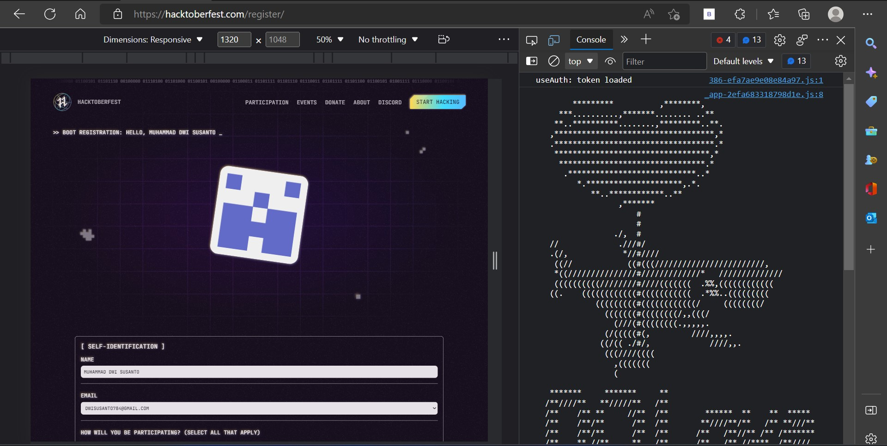
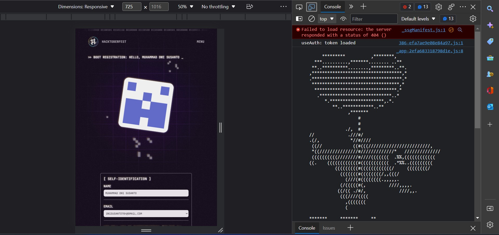
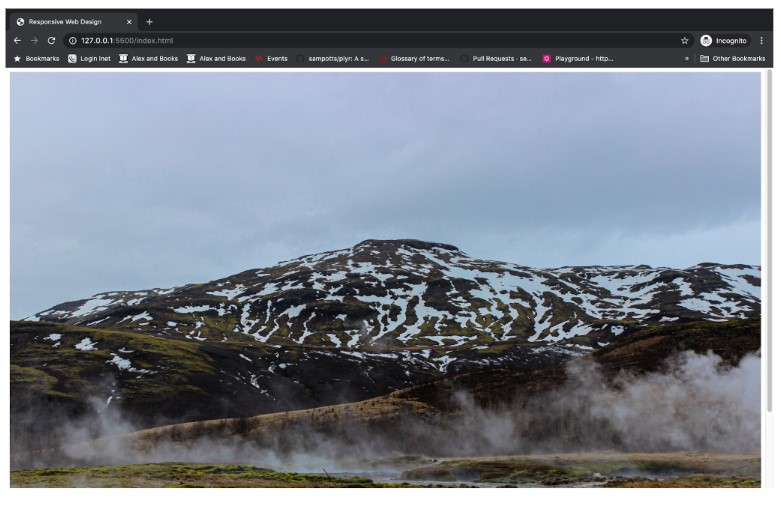
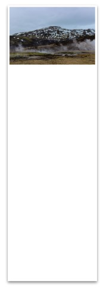
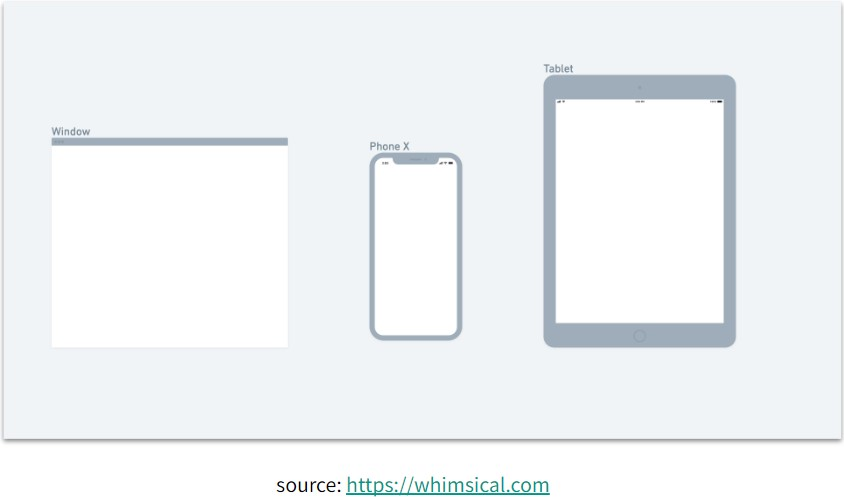

# <p style="text-align: center;">`Writing and Presentation Test Week 4 `</p>

---

## 1. Javascript - Asynchronous

### Introduction

- Javascript adalah bahasa pemrograman single-thread yang artinya hanya dapat mengeksekusi satu task pada satu waktu atau biasa disebut synchronous.
- Kita bisa membuat asynchronous secara simulasi artinya tidak murni asynchronous dengan beberapa cara:
  - Callback
  - Promises
  - Async/Await

### callback

- Callback function adalah function yang kita letakan di dalam argumen/parameter pada function, dan function tersebut akan dieksekusi setelah function pertama menyelesaikan tugasnya.

```js
const mainFunc = (number1, number2, callBack) => {
  console.log(number1 + number2);
  callBack();
};
const myCallback = () => {
  console.log('Done !');
};
main(1, 2, myCallback); // output 3 Done!
```

> Proses asynchronous identik dengan delay, dimana hasil dari proses tersebut membutuhkan selang waktu tertentu untuk menghasilkan output.
> Kita akan menemukan proses asynchronous pada proses Ajax, komunikasi HTTP, Operasi file, timer, dsb

```js
function p1() {
  console.log('p1 selesai dijalankan');
}
function p2() {
  console.log('p2 selesai dijalankan');
}
function p3() {
  console.log('p3 selesai dijalankan');
}
p1();
p2();
p3();
/* Output :
 p1 selesai dijalankan
 p2 selesai dijalankan
 p3 selesai dijalankan
 */
```

> Ini adalah synchronous yaitu program dijalankan sesuai urutan code

```js
const p1 = () => {
  console.log(`p1 telah selesai dijalankan`);
};
const p2 = () => {
  setTimeout(() => {
    console.log(`p2 selesai dijalankan`);
  }, 3000);
};
const p3 = () => {
  p1();
  p2();
  console.log(`p3 selesai dijalankan`);
};
p3();
```

> Pada asynchronous kita menggunakan setTimeOut untuk simulasinya. Proses function pada p2 kita lewati sambil menunggu selesai, program lanjut ke function p3

> setTimeout digunakan untuk simulasi asynchronous. Karena sebenarnya kita tidak bisa membuat proses asynchronous murni.

### callback

- Promise adalah salah satu fitur baru di ES6, biasa digunakan untuk melakukan http request/fetch data dari API.
- Dalam pengambilan data, promise memiliki 3 kemungkinan state.
  - Pending(sedang dalam proses)
  - Fulfilled (berhasil)
  - Rejected (gagal)

```js
const contohPromtse = () => {
  new Promise((resolve, reject) => {
    let condition = true;
    if (condition) {
      resolve('request fulfilled');
    } else {
      reject(new Error('terjadi kesalahan, reject'));
    }
  })
    .then((result) => console.log(result))
    .catch((error) => console.log(error));
};
contohPromise();
```

### Async-Await

- Async - await adalah salah satu fitur baru dari javascript yang digunakan untuk menangani hasil dari sebuah Promise.
- Sedangkan await berfungsi untuk menunda sebuah kode dijalankan sampai proses asynchronous berhasil.

```js
async function hello() {
  let result = await 'Hellooo';
  return result;
}
// es6
const hello = async () => {
  let result = await 'Helloo';
  return result;
};
```

### HTTP Request fetch()

- Fetch adalah native web API untuk melakukan HTTP calls dari external network.

```js
const URL = 'https://5e92be81bbff810016969173.mockapt.to/apt/vl/users';
const options = {
  method: 'GET' / 'POST',
  headers: {
    'Content-type': 'application/json',
  },
  body: user,
};
fetch(URL, options);
```

> fetch() memiliki parameter utama yaitu URL/endpoint API, dan parameter kedua yaitu options, options ini berisi method, headers dan body. Tergantung keinginan kita.

1. Contoh function untuk mengambil data dari API menggunakan fetch(), Promise based.

```js
const getDataAPI = () => {
  // deklarasi API endpoint
  const API = 'https://5e92be81bbff810016969173.mockapi.io/api/vl/users';
  // buat option method untuk fetch( )
  const option = {
    method: 'GET',
  };
  // jalankan fetch dengan apt dan option yang kita buat fetch(API, option)
  fetch(API, option)
    // response pertama, kita ambil data json
    .then((response) => response.json())
    .then((result) => console.log(result))
    // jika terjadi kesalahan kita tangkap errornya
    .catch((error) => console.log(error, 'ERROR'));
};
```

2. Contoh function untuk mengambil data dari API menggunakan fetch(), Dengan Async Await.

```js
const getDataAPIwithAsync = async () => {
  const API = 'https://5e92be81bbff810016969173.mockapt.to/apt/vl/users';
  const option = {
    method: 'GET',
  };
  let response = await fetch(API, option);
  response = await response.json();
  console.log(response);
};
getDataAPIwtthAsync();
```

## GitHub Lanjutan

### Kolaborasi membuat organizations

- masuk ke akun github anda
- klik `setting` -> `organizations` -> `new organizations`
- pick a plant yang diinginkan atau free
- set up your organization

## Responsive Web Design

- Responsive Web Design (RWD) adalah bertujuan membuat desain website kita dapat diakses dalam device apapun.

### Setting Up Chrome Dev Tools

- Setiap developer website wajib menggunakan tools bawaan dari setiap browser, yang memudahkan proses development website.
- pada browser chrome biasa disebut **chrome Dev Tools**
- untuk mengaksesnya menggunakan `ctrl` + `shift` + `J`

> tampilan Chtome Dev Tools, disini saya menggunakan edge karena edge sudah menggunakan teknologi yang sama layaknya google



- untuk mengakses tools responsice web menggunakan `ctrl` + `shift` + `M`



### Add Viewport In HTML

```html
<meta name="viewport" content="width=device-width, initial-scale=l.0" />
```

> HTML with meta Viewport

```html
<!DOCTYPE html>
<html lang="en">
  <head>
    <meta charset="UTF-8" />
    <meta name="viewport" content="width=device-width, initiat-scate=l.O" />
    <title>Responsive Web Design</title>
  </head>
  <body></body>
</html>
```

### Use max-width element

- ketika tidak menggunakan max-width element image akan menggunakan overflow ketika ditampilkan pada halaman yang lebih kecil dari image

```html

```

> pada web



> pada mobile



### Media Query

- Media query untuk responsive web design umumnya hanya menggunakan 2 jenis media query.
- Keduanya yaitu min-width dan max-width

### setting up media query

```css
@media screen and (min-width: your pixel) {
  /* your tag element html and your css */
}
@media screen and (max-width: your pixel) {
  /* your tag element html and your css */
}
```

- Media query digunakan untuk membuat beberapa styles tergantung pada jenis device.

### jenis-jenis device



### Ada 2 cara/pattern dalam menggunakan media query

1. membuat file css berbeda untuk masing-masing device

```html
<!DOCTYPE html>
<html lang="en">
  <head>
    <meta charset="UTF-8" />
    <meta http-equiv="X-UA-Compatible" content="IE=edge" />
    <meta name="viewport" content="width=device-width, initial-scale=1.0" />
    <title>Responsive Web Design</title>
    <!-- main.css untuk device laptop -->
    <link rel="stylesheet" href="styles/main.css" />
    <!-- main.mobile.css untuk device mobile -->
    <link
      rel="stylesheet"
      media="screen and (max-width: SOOpx)"
      href="styles/main.mobile.css"
    />
  </head>
  <body>
    <h2>Responsive Web Design (RWD)</h2>
  </body>
</html>
```

```css
/* file main.css */
body {
  background-color: black;
}
/* file main.mobile.css */
body {
  background-color: red;
}
```

2. menggabungkan file css untuk untuk setting styling berbagai device

```html
<!DOCTYPE html>
<html lang="en">
  <head>
    <meta charset="UTF-8" />
    <meta http-equiv="X-UA-Compatible" content="IE=edge" />
    <meta name="viewport" content="width=device-width, initial-scale=1.0" />
    <title>Responsive Web Design</title>
    <!-- main.css untuk all device -->
    <link rel="stylesheet" href="styles/main.css" />
  </head>
  <body>
    <h2>Responsive Web Design (RWD)</h2>
  </body>
</html>
```

```css
body {
  background-color: white;
}
/* Gunakan sintaks ini untuk set media query pada file css */
@media screen and (max-width: 500px) {
  body {
    background-color: aquamarine;
  }
}
```

### Breakpoint

- Perubahan yg terjadi pada tampilan saat berganti device atau ukuran width disebut breakpoint

### Complex Breakpoint Media Query

- Jika kita menginginkan tampilan yang ingin diterapkan pada range ukuran device tertentu, kita bisa membuatnya menjadi range media query.

```css
body {
  background-color: white;
}
/* Styling ini akan dijalankan jika width pada device Lebih atau sama dengan 500px dan maksimum 700px */
/* Styling ini tidak akan dijalankan jika width lebih dari 700px */
@media screen and (min-width: 500px) and (max-width: 700px) {
  body {
    background-color: aquamarine;
  }
}
```

### flexbox

- coming soon

### grid

- coming soon

## bootstrap

- Bootstrap adalah framework HTML, CSS, dan JavaScript yang berfungsi untuk mendesain website responsive dengan cepat dan mudah.

### cara menggunakan bootstrap

- ada banyak cara menggunakan bootstrap yaitu
  - mendownload source file
  - menggunakan CDN
  - menggunakan package manager seperti npm, yarn, rubyGems, composer, ataupun NuGet

### menggunakan CDN

```html
<!DOCTYPE html>
<html lang="en">
  <head>
    <meta charset="utf-8" />
    <meta name="viewport" content="width=device-width, initial-scale=1" />
    <title>Bootstrap demo</title>
    <link
      href="https://cdn.jsdelivr.net/npm/bootstrap@5.2.2/dist/css/bootstrap.min.css"
      rel="stylesheet"
      integrity="sha384-Zenh87qX5JnK2Jl0vWa8Ck2rdkQ2Bzep5IDxbcnCeuOxjzrPF/et3URy9Bv1WTRi"
      crossorigin="anonymous"
    />
  </head>
  <body>
    <h1>Hello, world!</h1>
    <script
      src="https://cdn.jsdelivr.net/npm/bootstrap@5.2.2/dist/js/bootstrap.bundle.min.js"
      integrity="sha384-OERcA2EqjJCMA+/3y+gxIOqMEjwtxJY7qPCqsdltbNJuaOe923+mo//f6V8Qbsw3"
      crossorigin="anonymous"
    ></script>
  </body>
</html>
```

### terdapat 6 Breakpoint pada bootstrap

| Heading 1         | Heading 2 | Heading 3 |
| :---------------- | :-------: | --------: |
| Extra small       |   None    |    <576px |
| Small             |    sm     |    ≥576px |
| Medium            |    md     |    ≥768px |
| Large             |    lg     |    ≥992px |
| Extra large       |    xl     |   ≥1200px |
| Extra extra large |    xxl    |   ≥1400px |
