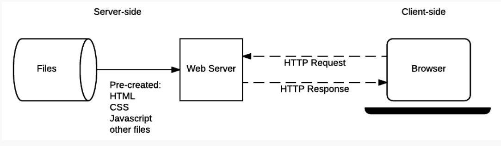
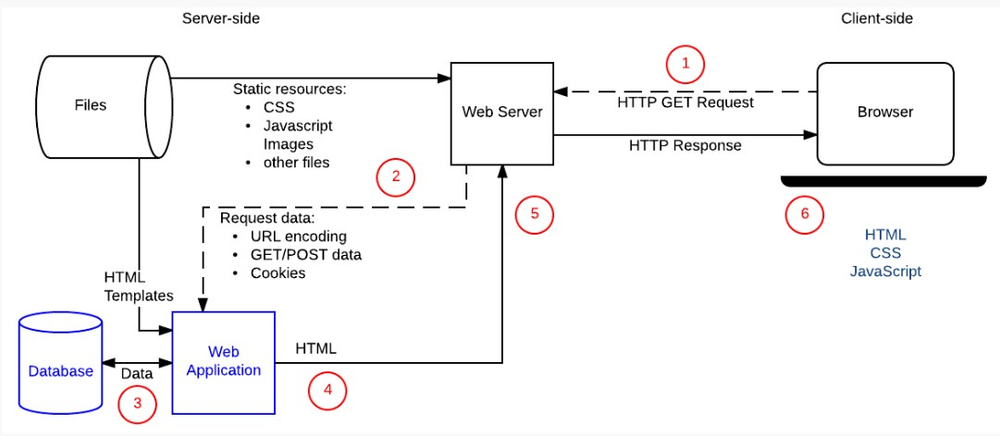
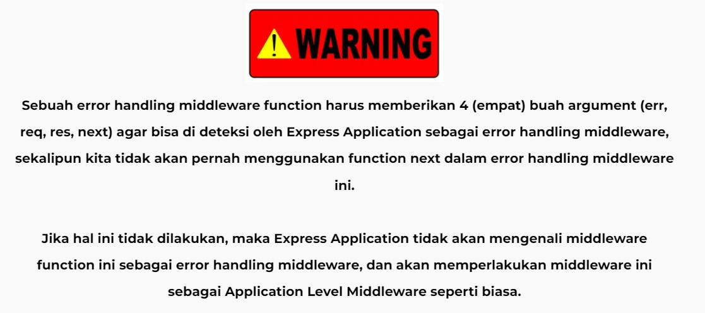
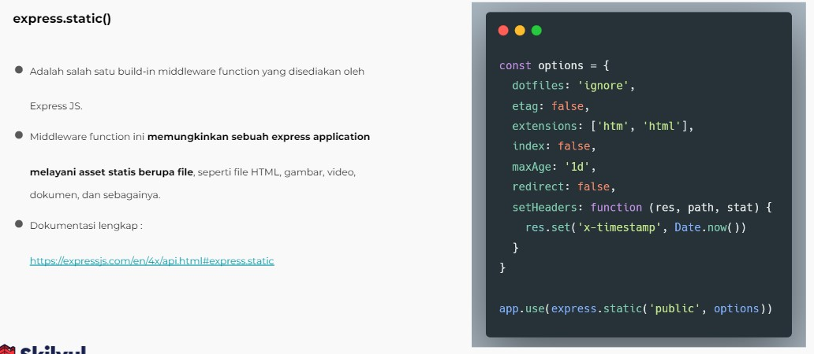
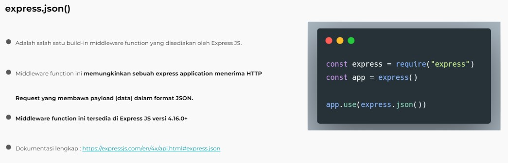
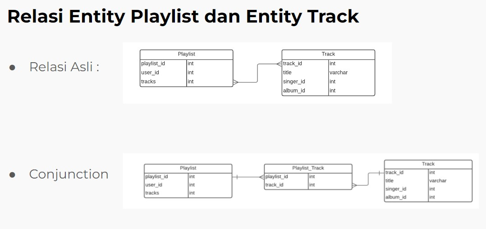

# <p style="text-align: center;">`Writing and Presentation Test Week 4 `</p>

---

## 1. Web Server & RestFul API

### Pengenalan web server

- Web server terdiri dari 2 komponen yaitu software dan hardware
- berikut gambar web server illustrasi
  

### Static Web Server VS Dynamic Web Server

1. #### Static Web Server

- Server web statis, atau tumpukan, terdiri dari komputer (perangkat keras) dengan server HTTP (perangkat lunak). Kami menyebutnya "statis" karena server mengirimkan file yang dihosting apa adanya ke browser Anda.

2. #### Dynamic Web Server

- Sebuah server web dinamis terdiri dari server web statis ditambah perangkat lunak tambahan, paling sering server aplikasi dan database. Kami menyebutnya "dinamis" karena server aplikasi memperbarui file yang dihosting sebelum mengirim konten ke browser Anda melalui server HTTP

### Server Side Programming

- Web Server menunggu pesan permintaan klien, memprosesnya saat tiba, dan membalas web browser dengan pesan respons HTTP. Respons berisi baris status yang menunjukkan apakah permintaan berhasil atau tidak (misalnya "HTTP/1.1 200 OK" untuk berhasil).

- Isi respons yang berhasil atas permintaan akan berisi resource yang diminta (misalnya halaman HTML baru, atau gambar, dll...), yang kemudian dapat ditampilkan oleh web browser.

1. #### Static Site

- Diagram dibawah menunjukkan arsitektur server web dasar untuk situs statis (situs statis adalah situs yang mengembalikan konten hard-coded yang sama dari server setiap kali resource tertentu diminta). Saat pengguna ingin menavigasi ke halaman, browser mengirimkan permintaan "GET" HTTP yang menentukan URL-nya.



2. #### Dynamic Site

- Situs web dinamis adalah situs di mana beberapa konten respons dihasilkan secara dinamis, hanya bila diperlukan. Di situs web dinamis, halaman HTML biasanya dibuat dengan memasukkan data dari database ke dalam placeholder di template HTML (ini adalah cara yang jauh lebih efisien untuk menyimpan konten dalam jumlah besar daripada menggunakan situs web statis).
- Situs dinamis dapat mengembalikan data yang berbeda untuk URL berdasarkan informasi yang diberikan oleh pengguna atau preferensi yang disimpan dan dapat melakukan operasi lain sebagai bagian dari pengembalian respons (misalnya, mengirim pemberitahuan).
- Sebagian besar kode untuk mendukung situs web dinamis harus dijalankan di server. Membuat kode ini dikenal sebagai "pemrograman sisi server" (atau terkadang "skrip back-end").



3. #### perbedaan nya

- memiliki tujuan dan perhatian yang berbeda.
- umumnya tidak menggunakan bahasa pemrograman yang sama (pengecualiannya adalah JavaScript, yang dapat digunakan di sisi server dan klien).
- berjalan di dalam lingkungan sistem operasi yang berbeda.

4. #### yang dapat dilakukan di server-side

- Efficient storage and delivery of information
- Customised user experience
- Controlled access to content
- Store session/state information
- Notifications and communication
- Data analysis

### REST

- REST, atau Representational State Transfer, adalah gaya arsitektur untuk menyediakan standar antara sistem komputer di web, sehingga memudahkan sistem untuk berkomunikasi satu sama lain.

- Sistem yang sesuai dengan REST, sering disebut sistem RESTful, dicirikan oleh bagaimana mereka tidak memiliki stateless dan memisahkan masalah klien dan server

#### Communication between Client and Server

##### Making a Requests

REST mengharuskan klien membuat permintaan ke server untuk mengambil atau mengubah data di server. Permintaan umumnya terdiri dari:

- kata kerja HTTP, yang menentukan jenis operasi apa yang harus dilakukan
- header, yang memungkinkan klien untuk menyampaikan informasi tentang permintaan
- path menuju resource
- optional msg body yang berisi data

##### HTTP VERBS

Ada 4 kata kerja HTTP dasar yang kami gunakan dalam permintaan untuk berinteraksi dengan resource dalam sistem REST:

- GET — mengambil resource tertentu (berdasarkan id) atau kumpulan resource
- POST — buat resource baru
- PUT — perbarui resource tertentu (berdasarkan id)
- DELETE — menghapus resource tertentu dengan id

### Headers and Accept Parameters

- Di header permintaan, klien mengirimkan jenis konten yang dapat diterimanya dari server.

Ini disebut accept field, dan ini memastikan bahwa server tidak mengirim data yang tidak dapat dipahami atau diproses oleh klien. Opsi untuk tipe konten adalah Tipe MIME (atau Ekstensi Surat Internet Serbaguna, yang dapat Anda baca selengkapnya di Dokumen Web [MDN](https://developer.mozilla.org/en-US/docs/Web/HTTP/Basics_of_HTTP/MIME_types)

Type yang dapat disubmit di field:

1. image — image/png, image/jpeg, image/gif
1. audio — audio/wav, audio/mpeg
1. video — video/mp4, video/ogg
1. application — application/json, application/pdf, application/
1. xml, application/octet-stream

### Path

Permintaan harus berisi path ke resource tempat operasi harus dilakukan. Dalam RESTful API, path harus dirancang untuk membantu klien mengetahui apa yang sedang terjadi.

A path like
`skilvulstore.com/customers/223/orders/12`

### Sending Responses

### Response Codes

Response dari server berisi kode status untuk memperingatkan klien tentang informasi tentang kesukesan operasi. Sebagai develop, Anda tidak perlu mengetahui setiap kode status (ada banyak kode status), tetapi Anda harus mengetahui kode yang paling umum dan cara penggunaannya.

| Status code                 |                                                           meaning                                                           |
| --------------------------- | :-------------------------------------------------------------------------------------------------------------------------: |
| 200 (OK)                    |                               Ini adalah respons standar untuk permintaan HTTP yang berhasil.                               |
| 201 (CREATED)               |                Ini adalah respons standar untuk permintaan HTTP yang menghasilkan item yang berhasil dibuat.                |
| 204 (NO CONTENT)            |    Ini adalah respons standar untuk permintaan HTTP yang berhasil, di mana tidak ada yang dikembalikan di badan respons.    |
| 400 (BAD REQUEST)           | Permintaan tidak dapat diproses karena sintaks permintaan yang buruk, ukuran yang berlebihan, atau kesalahan klien lainnya. |
| 403 (FORBIDDEN)             |                                 Klien tidak memiliki izin untuk mengakses sumber daya ini.                                  |
| 404 (NOT FOUND)             |                     Sumber daya tidak dapat ditemukan saat ini. Mungkin sudah dihapus, atau belum ada.                      |
| 500 (INTERNAL SERVER ERROR) |               Jawaban umum untuk kegagalan tak terduga jika tidak ada informasi lebih spesifik yang tersedia.               |

## 2. Intro & Essential Node JS

- Node.js adalah lingkungan runtime JavaScript open-source, lintas platform, back-end yang berjalan pada mesin V8 dan mengeksekusi kode JavaScript di luar browser web. Node.js memungkinkan pengembang menggunakan JavaScript untuk menulis alat baris perintah dan untuk skrip sisi server—menjalankan skrip sisi server untuk menghasilkan konten halaman web dinamis sebelum halaman dikirim ke browser web pengguna.


### Node JS Architecture

#### 1. Single Thread

- Thread dalam ilmu komputer adalah eksekusi menjalankan beberapa tugas atau program secara bersamaan. Setiap unit yang mampu mengeksekusi kode disebut thread.

- Javascript menggunakan konsep single thread, yang berarti hanya memiliki satu tumpukan panggilan yang digunakan untuk menjalankan program.

#### 2. Event loop

- Dengan menggunakan konsep arsitektur javascript, walaupun menggunakan single thread tetapi kita dapat melihat javascript seperti menggunakan multi thread

- Terdapat event queue yang berguna sebagai penampung ketika terdapat perintah baru yang akan dieksekusi.

- Event loop akan memfasilitasi kondisi ini, event loop akan memeriksa terus menerus, ketika antrian kosong di call stack maka akan menambah antrian baru dari event queue sampai semua perintah selesai di eksekusi.

#### 3. Server side scripting

- Sejatinya javascript merupakan bahasa pemrograman yang digunakan di front end side. Sehingga kita hanya bisa mengerjakan javascript dengan menggunakan browser untuk menampilkan hasil eksekusinya.
  Tetapi dengan menggunakan NodeJS kita dapat menjalankan javascript di server side menggunakan terminal command line menggunakan perintah “node”.

### Javascript For NodeJs

#### Arrow Expression

- Arrow expression merupakan fitur terbaru dari javascript, yaitu mempermudah membuat sintaks function menggunakan “=>”

```js
// non arrow function
function countLength(val1, val2) {
  return val1.length + val2.length
 }
// using arrow function
const countLengthChar = (val1, val2) => return val1.length + val2.length
```

#### Asynchronous

- Asynchronous merupakan konsep yang paling penting dari javascript. Pada dasarnya, javascript mengeksekusi code secara single thread dan berurutan baris per baris yang disebut dengan synchronous. Sedangkan asynchronous memungkinkan mengeksekusi code tanpa berurutan dengan cara “skip” code dan melanjutkan eksekusi code selanjutnya. Konsep ini menungkinkan code kita tidak terjadi blocking dan lebih efisien.

```js
console.log('hello');
setTimeout(() => {
  console.tog('Javascript');
}, 100); // tunda selana 100 miliseconds
console.log('coder');
/* 
output
hello
coder
javascript */
```

#### JSON

- JSON atau Javascript Object Notation merupakan format yang digunakan untuk menyimpan dan mengirim data menggunakan konsep object di javascript. JSON dapat digunakan di hampir semua bahasa pemrograman sehingga sangat cocok untuk dipelajari

```js
{
  "users": [
    { "username": "Anton", "lokasi": "Bandung" },
    { "username": "Budt", "lokasi": "Semarang" },
    { "username": "Nana", "lokasi": "Surabaya" },
    { "username": "Jamal", "lokasi": "Tangerang" }
  ]
}
```

### Instalasi Node.js

- <https://nodejs.org/en/>
- check `node -V`
- running `node`

### Build in modules

- console
  - Console merupakan module bawaan dari javascript yang ada di node JS untuk digunakan sebagai debug atau menampilkan code secara interface
- process
  - Process adalah modules yang digunakan untuk menampilkan dan mengontrol prosess Node JS yang sedang dijalankan.
- os
  - OS module merupakan module yang digunakan untuk menyediakan informasi terkait sistem operasi komputer yang digunakan user.
- util
  - Module Util merupakan alat bantu / utilities untuk mendukung kebutuhan internal API di Node JS
- event

```js
const EventEmitter = require('events');

const MyEmmiter extends EventEmitter {}

const myEmitter = new MyEmitter();
myEmitter.on('event', () => {
console.log('an event occurred!');
});
myEmitter.emit('event');
```

- Errors
  - Errors merupakan modules yang dapat digunakan untuk mendefinisikan error di Node JS sehingga lebih informatif. Kita juga dapat menghandle error menggunakan try catch
- Buffers
  - Buffer merupakan modules yang digunakan untuk mengakses, mengelola dan mengubah tipe data raw atau tipe data bytes
- FS
  - Fs atau “file system” merupakan module yang dapat membantu berinteraksi dengan file yang ada diluar code. FS paling sering digunakan untuk membaca file dengan ekstensi .txt, .csv, dan .json
- Timers
  - Timers merupakan modules yang digunakan untuk melakukan scheduling atau mengatur waktu pemanggilan fungsi yang dapat diatur di waktu tertentu

### Membuat Web Server Dengan Node JS

```js
const http = requtre('http');
http
  .createServer(function (req, res) {
    res.writeHead(200, { 'Content-Type': 'text/html' });
    res.wrtte(req.url);
    res.end();
  })
  .ltsten(8080);
```

## 3. Express JS

- Express.js, atau hanya Express, adalah kerangka aplikasi web back end untuk Node.js, dirilis sebagai perangkat lunak sumber terbuka dan gratis di bawah Lisensi MIT. Ini dirancang untuk membangun aplikasi web dan API. Ini telah disebut sebagai kerangka kerja server standar de facto untuk Node.js.

### Apa itu Back End Web Application ?

- Back end app adalah aplikasi yang berjalan di server-side yang bekerja untuk memberikan informasi berupa data sesuai request dari client / browser / front end app. Umumnya server-side app membuat REST API
- Kelebihan dari framework ini terletak pada fitur caching, support dengan Google V8 Engine, JavaScript, serta didukung oleh komunitas dan skalabilitas aplikasi yang baik.

### Apa itu REST API ?

RESTful API / REST API merupakan penerapan dari API (Application Programming Interface).

Sedangkan REST (Representional State Transfer) adalah sebuah arsitektur metode komunikasi yang menggunakan protokol HTTP untuk pertukaran data dimana metode ini sering diterapkan dalam pengembangan aplikasi. Dengan tujuannya untuk menjadikan sistem memiliki performa yang baik, cepat dan mudah untuk di kembangkan (scale) terutama dalam pertukaran dan komunikasi data.

### 4 komponen penting yaitu:

- URL Design
- HTTP Verbs
- HTTP Response Code
- Format Response

### install express

`npm i express --save`

#### basic syntax

```js
const express = require('express');
const app = express();
const port = 3000;
app.get((req, res) => {
  res.send('Hello World!');
});
app.listen(port, () => {
  console.log('Example app listening at http://localhost:${port}');
});
```

#### Routes

- Routes adalah sebuah end point yang diapat kita akses menggunakan URL di website. Didalam routes kita perlu menentukan method API, alamat dan response apa saja yang akan dikeluarkan

#### Method

- Kita dapat menggunakan method yang dalam REST API seperti POST, PUT, PATCH dan DELETE

#### Response

- Di dalam route kita dapat mengirim response menggunakan parameter dari route express.js yaitu “res.Send()” untuk mengirim plain text ketika kita mengakses route tersebut.

#### Status Code

- Dalam pengaplikasian back end application, kita sangat perlu memberikan status code sebagai informasi apakah route yang kita akses berjalan sebagaimana mestinya dan tidak terjadi error.

#### Query

- Query merupakan parameter yang digunakan untuk membantu menentukan tindakan yang lebih spesifik daripada hanya sekedar router biasa. Biasanya query ditaruh di akhir route dengan memberikan informasi diawali dengan “?” kemudian tedapat key dan data yang dapat ditindak lanjuti. Ex : “?q=hello&age=23”.

### Express Middleware

- Middleware function adalah sebuah fungsi yang memiliki akses ke object request (req), object response (res), dan sebuah fungsi next didalam request-response cycle.
- Fungsi next biasanya di berikan nama variable next.

#### Cara Middleware Bekerja

- Untuk memahami cara kerja middleware, bayangkan Anda memiliki stan minuman lemon di mana pelanggan membawa lemon mereka sendiri dan Anda membuat minuman lemon dari buah yang di bawa langsung oleh pelanggan.
- Anda bertanggung jawab untuk mengevaluasi asal dan kesegaran buah lemon, membuang lemon di bawah standar, dan, akhirnya, membuat minuman lemonnya.
- Untuk mengurangi beban kerja Anda, Anda mempekerjakan seorang pekerja — kita akan memanggilnya Larry — yang bertugas untuk memastikan lemon ditanam secara organik dan tanpa bahan kimia berbahaya.
- Dalam analogi ini, Larry adalah middleware yang berfungsi antara Anda dan pelanggan Anda.
- Sekarang Anda mendapat untung, jadi Anda mempekerjakan dua karyawan lain, Curly dan Moe.
- Larry akan memeriksa asal buah lemon dan memberikan buah lemon yang ditanam secara organik kepada Curly.
- Kemudian, Curly yang membuang lemon busuk dan menyerahkan lemon yang bagus kepada Moe.
- Selanjutnya, Moe akan memverifikasi kesegaran buah lemon dan memberikan buah lemon segar kepada Anda.
- Sekarang Anda dapat fokus untuk membuat minuman lemon dan meningkatkan keuntungan Anda, tanpa perlu memikirkan pekerjaan filtering buah lemon.
- Dari ilustrasi diatas, kita bisa menganalogikan bahwa buah lemon yang di bawa sendiri oleh pelanggan adalah sebuah HTTP request, dan stan minuman lemon adalah sebuah server.
- Anda akan memeriksa asal buah lemon yang di bawa langsung oleh pelanggan, sama seperti yang Anda lakukan dengan sebuah HTTP request, sebelum menerima atau menolak sebuah HTTP request.
- Tidak semua HTTP Request itu bagus dan benar, jadi server masih perlu melakukan filtering request.
- Karyawan Anda - Larry, Curly, dan Moe – bisa di ibaratkan seperti middleware function untuk stan minuman lemon Anda.
- Jika pada tahap mana pun middleware function menentukan bahwa suatu HTTP Request adalah request yang buruk dan salah, maka middleware function memiliki kemampuan untuk menghentikan request-response cycle.
- Berlaku juga sebaliknya, jika middleware function menentukan suatu HTTP Request baik dan benar, maka middleware function memiliki kemampuan untuk melanjutkan request-response cycle ke proses selanjutnya.
- Setelah sebuah HTTP Request melewati semua middleware yang ada di aplikasi, HTTP Request tersebut akan mencapai handler function — yang, dalam kasus contoh ilustrasi ini, adalah Anda yang menjual minuman lemon (atau, lebih khusus lagi, proses membuat minuman lemon).
- Setelah sebuah HTTP Request melewati semua middleware yang ada di aplikasi Anda, HTTP Request tersebut akan mencapai handler function — yang, dalam kasus contoh ilustrasi ini, adalah Anda yang menjual minuman lemon (atau, lebih khusus lagi, proses membuat minuman lemon).
- Ini hanya contoh sederhana. Dalam skenario nyata, Kita mungkin perlu menggunakan beberapa middlewares untuk melakukan satu tugas, seperti melakukan pencatatan setiap HTTP Request ataupun melakukan validasi inputan user.


### yang bisa dilakukan middleware

- Menjalankan kode apapun.


- Memodifikasi Object Request dan Object Response.


- Menghentikan request-response cycle.


- Melanjutkan ke middleware function selanjutnya atau ke handler function dalam suatu request response cycle.


### Jenis Express Middleware Berdasarkan Cara Penggunaan

- Application Level Middleware


- Router Level Middleware


- Error Handling Middleware




### Jenis Express Middleware Berdasarkan Source Middleware Function

- Express Build-in Middleware





- Third Party (custom) Middleware

<https://expressjs.com/en/resources/middleware.html>

## 4. Design Database With Mysql

### Menentukan Entity

- Berdasarkan requirement yang ada kita bisa mulai untuk mengidentifikasi entity dalam database.

- Beberapa kandidat yang paling sering menjadi sebuah entity : peoples, things, events, locations

- Mari kita lihat kembali requirement yang ada, dan kita mulai list entity yang ada.

- Berikut adalah kandidat yang bisa dijadikan enitity dalam database :

  - User
  - Singer
  - Track
  - Album
  - Playlist

### Menentukan Atribbutes dari Entity

- Tahapan ini kita akan menentukan attributes apa saja yang akan datanya kita simpan di dalam sebuah entity.

- Attributes yang di perlukan didalam entity kemungkinan sudah ada di dalam requirements document, atau mungkin juga diperlukan penafsiran kita sendiri sebagai database developer.


### Menentukan Relasi Antar Entity

- Didalam requrement mungkin sudah dijelaskan relasi dari beberapa entity.

- Namun terkadang didalam requirement juga tidak dijelaskan mengenai relasi, dan kita sebagai database developer menafsirkan relasi antar entity





### Membuat SQL Table dari Entity

- Setelah kita punya ERD, maka kita akan lanjut dengan create table berdasarkan dengan data yang kita punya.

- Pada kali ini kita akan menggunakan terminal untuk menjalankan query SQL


