# <p style="text-align: center;">`Writing and Presentation Test Week 7 `</p>

---

## 1. Sequelize

### pengenalan sequelize

- Sequelize adalah ORM (Object Relational Mapping) Node JS yang berbasis promise. Sequelize mendukung sebagian besar relational Database seperti MySQL, PostgresQL, MariaDB, SQLite dan Miscrosoft SQL Server.

- Dengan fitur fitur di Sequelize, kita bisa mengelola dan mengatur data di database kita dengan cepat, dan efisien.

### ORM

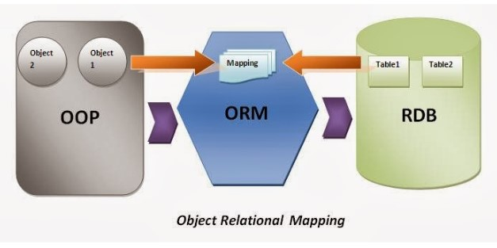

- ORM adalah suatu metode/teknik pemrograman yang digunakan untuk mengkonversi data dari lingkungan bahasa pemrograman berorientasi objek (OOP) dengan lingkungan database relational.

### install sequelize

#### Sequelize-cli

- Kita perlu menginstall sequelize cli agar dapat menjalankan generator menggunakan terminal sehingga lebih mudah.

```command
npm i -g sequelize-cli
```

- Ketika kita melakukan inisiasi project kita pertama perlu menginstall sequelize menggunakan npm install sequelize dan perlu menginstall driver sql yang kita butuhkan

```
npm i --save sequelize
npm i --save mysql2
```

### Generate sequelize

#### Sequelize init

- Pertama kita perlu melakukan inisialisasi di project kita terlebih dahulu agar dapat melakukan generate code

```
npx sequelize-cli init
```

#### setting db

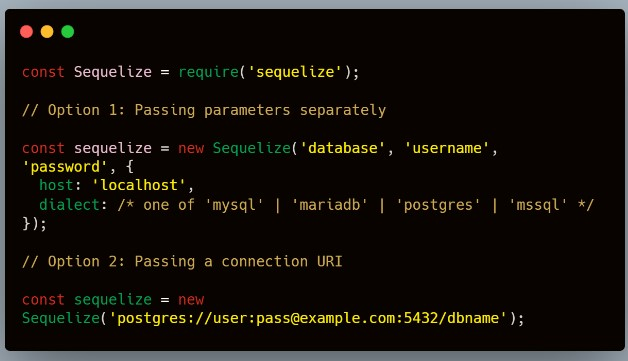

#### Generate model

- Mari kita membuat table todo dengan field seperti gambar di bawah

```
npx sequelize-cli model:generate --name Todo --attributes title:string,description:string,startTime:date,status:string
```

- Kita bisa melihat datanya menjadi sebuat class (OOP) dan dapat kita gunakan untuk membuat Rest API menggunakan express atau dapat memberikan behaviour di statenya

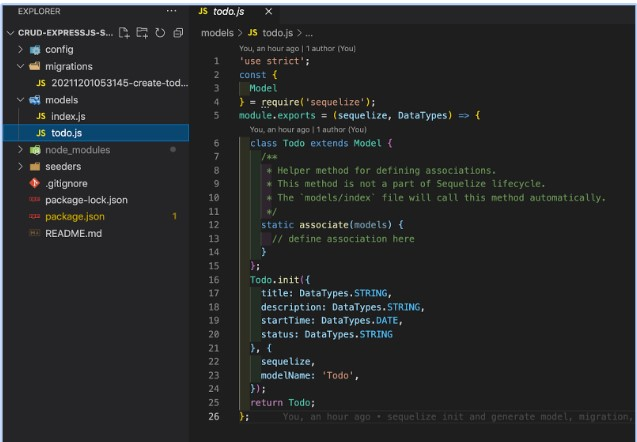

- Akhirnya kita dapat menggunakan generate dan kita bisa mengecek ke database sehingga dapat kita gunakan untuk penimpanan DB

```
npx sequelize-cli db:migrate
```

- Jika ada yang salah, kita bisa mengembalikan (undo) menggunakan :

```
npx sequelize-cli db:migrate:undo
```

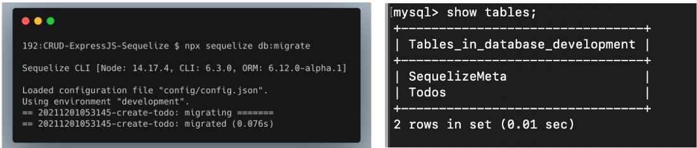

- Ketika kita berhasil melakukan generate maka kita dapat melihat di database ada 1 table baru yang bernama Todos dan ada table SequelizeMete

#### Generate seed

- Seed adalah data awal yang bisa kita gunakan untuk mengisi data di database untuk keperluan awal project menggunakan sequelize

```
npx sequelize-cli seed:generate --name demo-todo
```

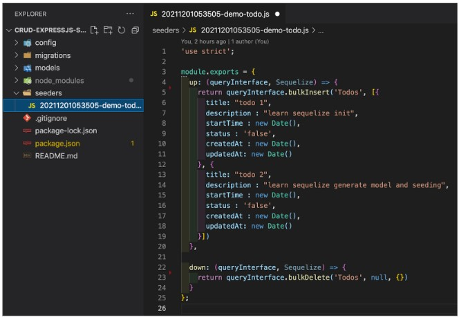

- Ketika sudah berhasil melakukan generate maka kita dapat melakukan pengisian data seed didalam file seed generator. Terdapat 2 data yang diisi yaitu “up” untuk mengisi data di db, dan “down” untuk drop atau menghapus semua data seed di db

- Kita kemudian menjalankan generate seed menggunakan sequelize

```
npx sequelize-cli db:seed:all
```

- Jika ada yang salah, kita bisa mengembalikan (undo) menggunakan

```
npx sequelize-cli db:seed:undo
```

- Ketika kita menjalankan generate seed menggunakan terminal, maka kita dapat melihat bahwa seeding kita sudah berhasil ter insert ke db.

### membuat CRUD dengan Express dan Sequelize

#### get all todo

- Untuk Kita akan membuat sebuah routing entuk get all todo dengan syntax berikut

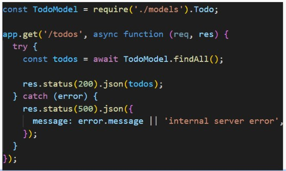

- Ketika kita akses endpoint tersebut, maka akan menghasilkan result seperti ini :
  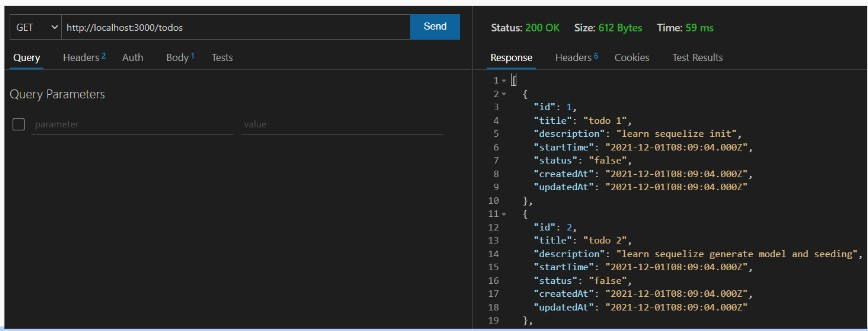

#### get todo by id

- Untuk Kita akan membuat sebuah routing entuk get detail todo berdasarkan Id todo dengan syntax berikut

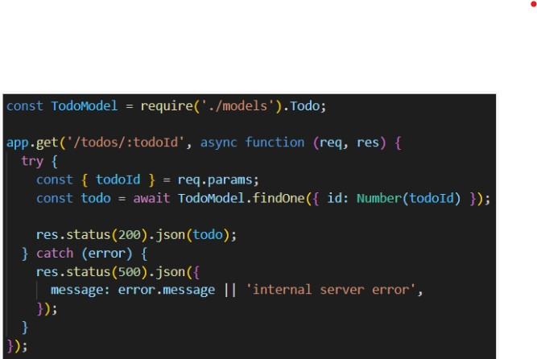

- Ketika kita akses endpoint tersebut, maka akan menghasilkan result seperti ini :

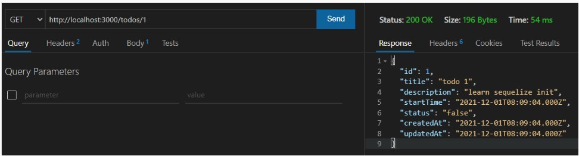

#### create new todo

- Untuk Kita akan membuat sebuah routing entuk create new todo dengan syntax berikut

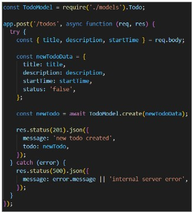

- Ketika kita akses endpoint tersebut, maka akan menghasilkan result seperti ini :

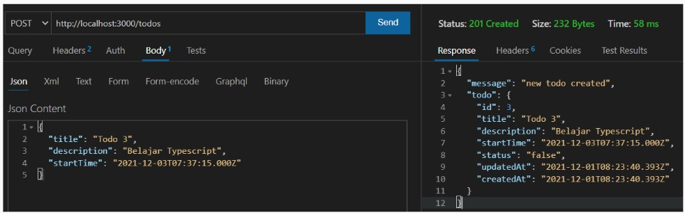

#### update todo by id

- Untuk Kita akan membuat sebuah routing entuk update todo by Id dengan syntax berikut

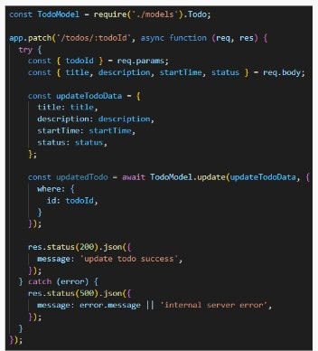

- Ketika kita akses endpoint tersebut, maka akan menghasilkan result seperti ini :

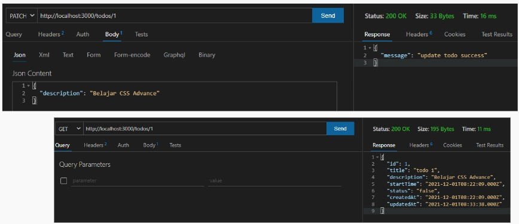

#### delete todo

- Untuk Kita akan membuat sebuah routing entuk delete todo by Id dengan syntax berikut

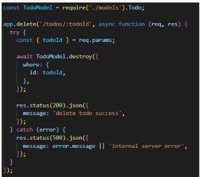

- Ketika kita akses endpoint tersebut, maka akan menghasilkan result seperti ini :

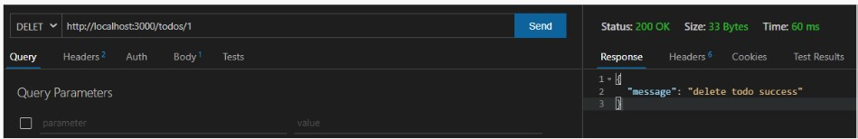
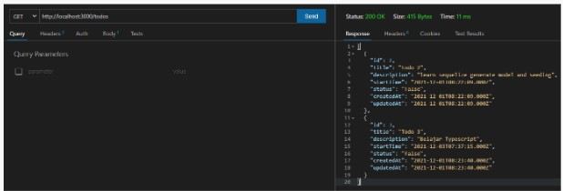

## 2. postman

### Apa Itu Postman

- Postman adalah tools yang bisa digunakan untuk menguji sebuah API.
- Postman memiliki graphical user interface (GUI) sehingga dapat digunakan dan dipahami oleh backend developer.
- Postman bisa di download secara gratis dan dapat berjalan pada sistem operasi Windows, Linux, maupun macOS.

### Instalasi Postman

- Karena Postman tersedia dalam banyak platform OS (Windows, Linux, Mac), maka tiap OS punya cara instalasinya tersendiri
- Silakan ikuti instruksi, sesuai dengan sistem operasi yang Anda gunakan untuk install postman.
- https://learning.postman.com/docs/getting-started/installation-and-updates/

### Komponen UI Postman

- Mari kita berkenalan dengan komponen UI yang ada di dalam aplikasi Postman.
- Ada beberapa komponen UI basic yang harus kita pahami untuk memulai menggunakan Postman sebagai tool pengujian REST API.
- Beberapa Komponent tersebut, adalah sebagai berikut :
  - Request Tab
  - Method Path Request
  - HTTP Method Selector
  - Request Options
  - Response

### Komponen UI Postman : Request Tab

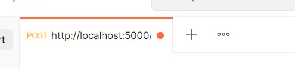

- Komponen ini merupakan tab dari halaman request.

- Sama seperti pada web browser, ketika membuka halaman browser baru, kita bisa membuka tab baru. Begitu juga dengan Postman, bila ingin membuat request baru, bisa dengan cara membuka tab baru.

### Komponen UI Postman : HTTP Method Selector

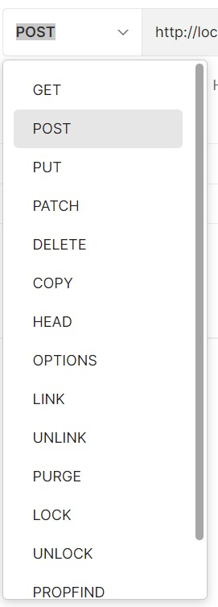

- Postman mendukung seluruh method yang ada di HTTP Request.
- Secara mudah kita bisa mengubah method yang digunakan dengan menekan opsi dropdown yang tersedia.

### Komponen UI Postman : Request Options

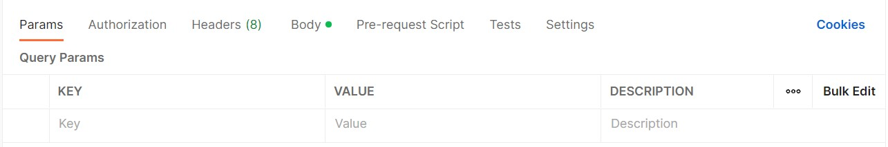

- Komponen ini digunakan untuk menyisipkan data dalam bentuk params URL, authorization, Headers, Body, dan lainnya.
- Kita dapat secara mudah menyisipkan data pada request melalui komponen ini.

### Komponen UI Postman : Response

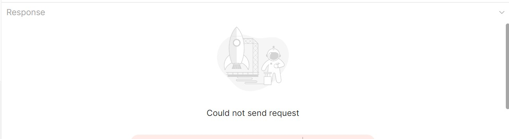

- Ketika mengirimkankan request, maka response body akan ditampikan pada komponen ini.
- Response dari server akan ditampilkan secara terformat sesuai dengan Content-Type yang diberikan server.
- Jika responsnya HTML, ia akan di render layaknya pada browser. - Jika JSON, ia akan diformat dengan struktur JSON.

### Test REST API

- Pada kali ini, kita akan mulai melakukan pengujian REST API yang sudah kita kerjakan sebelumnya (CRUD Todo List) dengan menggunakan Postman.

- Kita akan melakukan pengujian terhadap method-method berikut :

  - Create New Todo
  - Get All Todo
  - Get Todo By Id
  - Update Todo By Id
  - Delete Todo By Id

- NOTE : Pastikan server sudah dalam kondisi aktif sebelum melakukan proses pengujian REST API dengan menggunakan Postman

#### Test REST API : Create New Todo

- Untuk create new todo, pada halaman request method menjadi POST. Kemudian isi request URL dengan url server, contoh http://localhost:3000/todos.

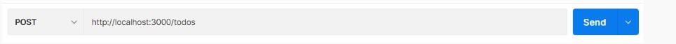

- Kemudian pilih tab Body untuk melakukan setting body request.

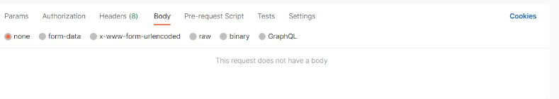

- Pilih option raw kemudian ganti format text menjadi JSON, kemudian input data body JSON, Seperti berikut

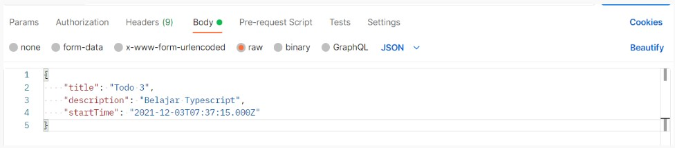

- klik send, dan kita akan menerima response dari server.

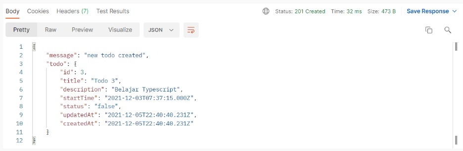

#### Test REST API : Get All Todos

- Untuk get all todos, Pada halaman request method pilih method GET. Kemudian isi request URL dengan url server, contoh http://localhost:3000/todos.

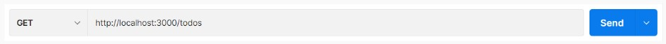

- Untuk get all todos, kita tidak perlu menambahkan request body, langsung saja klik send, dan kita akan menerima response dari server

- Untuk get all todos, kita tidak perlu menambahkan request body, langsung saja klik send, dan kita akan menerima response dari server

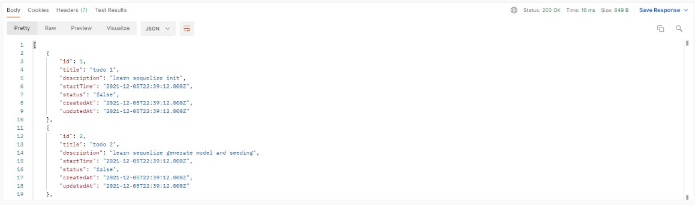

#### Test REST API : Update Todo By Id

- Untuk update todo by Id, pada halaman request method pilih method PATCH. Kemudian isi request URL dengan url server, contoh http://localhost:3000/todos/<id todo yang ingin di update>

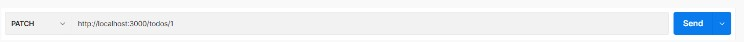

- Kemudian pilih tab Body untuk melakukan setting body request.

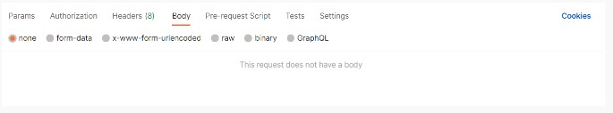

- Pilih option raw kemudian ganti format text menjadi JSON, kemudian input data body JSON, Seperti berikut

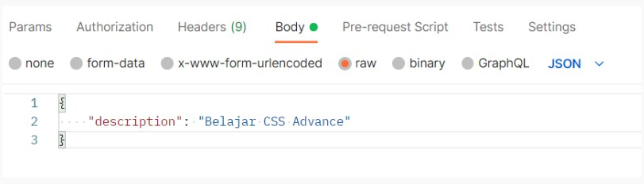

- klik send, dan kita akan menerima response dari server.

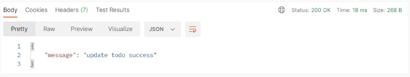

#### Test REST API : Delete Todo By Id

- Untuk delete todo by Id, pada halaman request method pilih method DELETE. Kemudian isi request URL dengan url server, contoh http://localhost:3000/todos/<id todo yang ingin di hapus>.

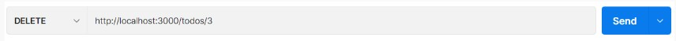

- Untuk delete todo by id, kita tidak perlu menambahkan request body, langsung saja klik send, dan kita akan menerima response dari server

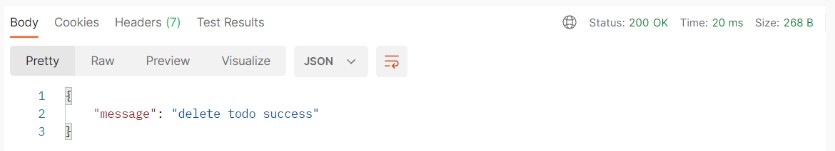

#### Postman Collection

- Postman collection adalah tempat menyimpan kumpulan-kumpulan request.
- Kita bisa menganggap collection adalah sebuah folder yang menyimpan berkas, namun berkas yang akan disimpan itu adalah request.
- Dengan adanya collection request bisa Anda kelompokkan sehingga lebih mudah untuk diakses.
- Berikut adalah contoh collection Todos API Test.
  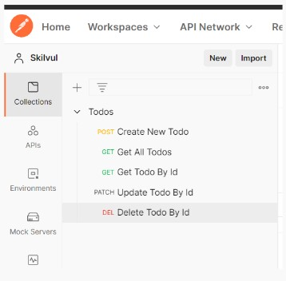

#### Postman Environment

- Postman Environment merupakan kumpulan dari variabel yang dapat digunakan pada request di Postman.
- Ketika menggunakan Postman, terkadang kita perlu menyimpan nilai pada sebuah variabel.
- Contohnya ketika melakukan pengujian REST API yang sama, namun berada di 2 server yang berbeda. Maka kita perlu membuat variabel enviroment agar collection kita bisa bersifat dinamis.
- Variabel tak hanya digunakan untuk kasus tersebut saja, melainkan dapat juga untuk menyimpan nilai token, auth-key, atau nilai lainnya yang dipakai selama proses uji.
- Berikut adalah tampilan environment pada Postman.

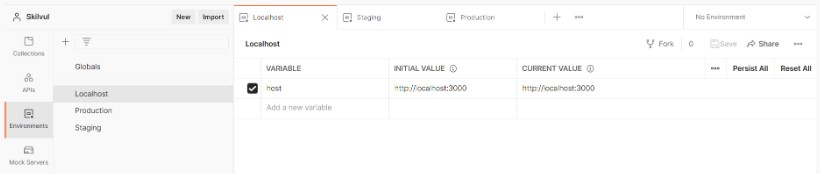

- Environment dapat digunakan pada collection atau spesifik request.

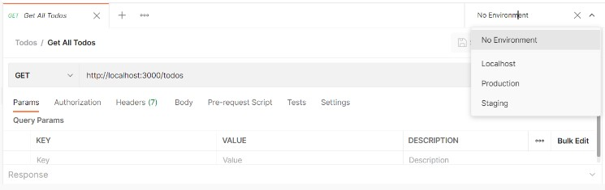

- Untuk menggunakan variabel environment pada request, bisa dituliskan nama variabel-nya yang dibungkus dengan kurung kurawal ganda, contoh: {{host}}

- Notasi tersebut dapat digunakan di request URL, parameters, headers, dan body data.

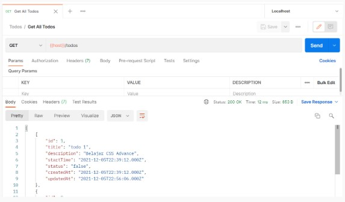

#### Publish API Documentation

- Postman secara otomatis akan membuat dokumentasi basic untuk setiap collection yang sudah kita buat.
- Kita Cukup melihat dokumentasi untuk mendapatkan detail semua request yang ada di dalam sebuah collection.
- Agar dokumentasi yang sudah di buat lebih bermanfaat bagi pengguna, kita bisa menambahkan deskripsi pada sebuah request di dalam collection.
- Agar dokumentasi yang sudah di buat lebih bermanfaat bagi pengguna, kita bisa menambahkan deskripsi pada sebuah request di dalam collection.

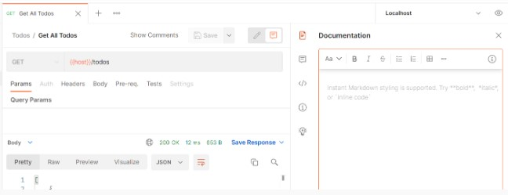

- Kita dapat membuat collection baru untuk menyimpan dan mengatur dokumentasi dari suatu REST API yang kita kerjakan.
- Secara default, dokumentasi ini akan bersifat private, jadi hanya orang yang sudah di berikan akses ke collection tersebut yang dapat melihatnya.
- Atau jika akan membuat API publik, kita bisa mempublikasikan dokumentasi agar tersedia secara publik bagi siapa saja.

#### Cara Membuat API Documentation Menggunakan Postman

- Buka Collection yang ingin di buat dokumentasinya, kemudian pilih View documentation

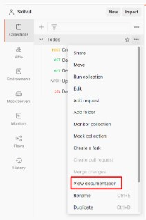

- Kemudian akan tampil halaman documentation

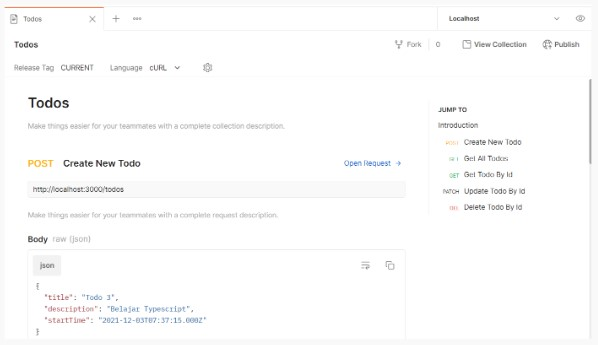

- Pada halaman documentation tersebut, kita bisa menambahkan deskripsi documentation, deskripsi pada setiap request.

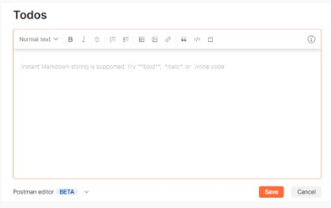

- Selain itu kita juga bisa melihat detail dari sebuah request, seperti HTTP Method, url, request body, request header, dll.

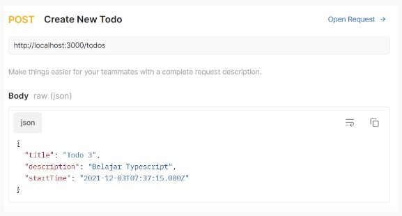

- Kita bisa juga mempublish documentation agar bisa diakses oleh public

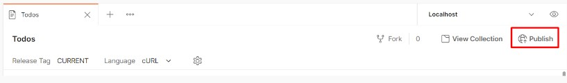

- Contoh Dokumentasi Publik : https://documenter.getpostman.com/view/18657345/UVJhEFRg

## Mongodb

- MongoDB adalah salah satu database open source NoSQL yang cukup populer digunakan.
- MongoDB sering dipakai untuk aplikasi berbasis Cloud, Big Data maupun Grid COmputing
- Jika SQL menyimpan data menggunakan relasi tabel, MongoDB menggunakan dokumen dengan format JSON

### NoSQL

- NoSQL adalah Not Only SQL
- Artinya kita bisa mengolah database dengan fleksibel dan tidak membutuhkan Query
- Akhirnya kita memiliki skalabilitas yang tinggi sesuai dengan perkembangan data kita.

#### Kelebihan

- Sistem tidak membutuhkan Tabel
- Tidak perlu menggunakan Tabel yang terstruktur
- By Default sudah menggunakan JSON(JavaScript Object Notation), sehingga memudahkan integrasi dengan JavaScript
- Performa lebih cepat dengan kemampuan menampung banyak data yang bervariasi

#### Kekurangan

- Tidak mendukung transaksi
- Masalah konsistensi data
- Menggunakan banyak memory
- Hanya bisa menampung maksimal 16MB disetiap document

### Anatomi komponen dari Database MongoDB

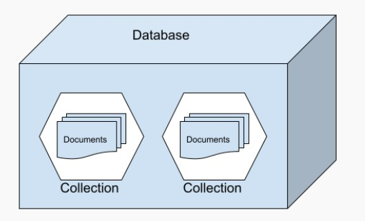

- Database adalah wadah untuk menyimpan berbagai macam Collection
- Collection adalah tempat kumpulan dari berbagai macam document, sehingga collection sering disamakan dengan tabel pada SQL
- Document adalah unit terkecil yang berada pada MongoDB

### Contoh data pada MongoDB

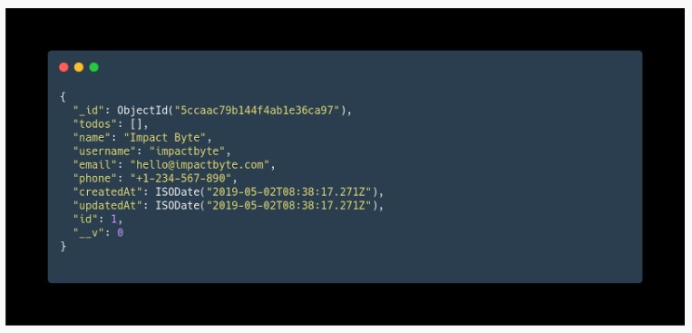

### Proses Instalasi MongoDB

- Untuk proses lengkap bisa kunjungi dokumentasi MongoDB.

- https://docs.mongodb.com/manual/administration/install-community

### Proses Instalasi pada Ubuntu

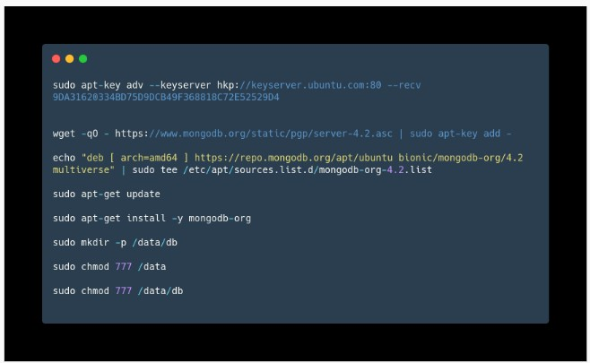

### Proses Instalasi pada Mac


### Command pada MongoDB

```
sudo service mongod start
sudo service mongod stop
sudo service mongod restart
```

### MongoDB GUI Tools

- Untuk mempermudah kita bisa menggunakan GUI Tools Official dari MongoDB yaitu MongoDB Compass

- Link untuk download MongoDB Compass

- https://www.mongodb.com/products/compass

### Operasi CRUD MongoDB

- Kita bisa mulai dengan menyalakan MongoDB, lalu kita bisa mengakses dengan mengetikan “mongo” pada terminal

Untuk melihat database yang aktif, bisa gunakan db pada MongoDB shell

```
db
```

Untuk melihat daftar database bisa menggunakan show dbs

```
show dbs
```

Untuk Database baru gunakan use

```
use <name db>
use music
```

Untuk menambahkan Collection baru kita bisa gunakan

```
db.createCollections(“artis”)
```

Untuk menambahkan data pada Collection kita bisa gunakan

```
db.artis.insert({
    nama: "Peterpan",
    genre: "pop"
})
```

Untuk melihat data kita gunakan

```
db.artis.find()
```

Untuk mengupdate data pada Collection kita bisa gunakan

```
db.artis.update({
'nama':'Peterpan'
},{
$set:{'nama':'Noah'}
})
```

Untuk mengupdate data pada Collection kita bisa gunakan

```
db.artis.remove({
'nama': ‘Noah’
})
```

## Docker

sebuah platform yang digunakan untuk membuat maupun menjalankan aplikasi dengan cara menyatukan berbagai file dalam sebuah container. container digunakan sebagai alternatif agar pengguna tidak perlu menyiapkan sistem operasi secara penuh ketika menggunakan virtualisasi di server, tujuan virtualisasi adalah aplikasi bisa berjalan di berbagai platform dengan konfigurasi hardware yang berbeda-beda. selain itu aplikasi pada docker dijalankan dalam lingkungan yang terisolasi sehingga dapat menjalankan banyak container di waktu yang bersamaan pada host tertentu. Docker akan menyediakan hal-hal yang diperlukan untuk aplikasi mulai dari akses file, koneksi internet, hingga port agar aplikasi dapat berjalan dengan mulus

### Perbedaan docker dengan virtual machine


VM memakan banyak resource dan waktu utk booting karena melakukan virtualisasi pada host hardware-nya. Sedangkan container kebalikannya dari vm, container melakukan virtualisasi pada host OS-nya.

untuk lebih jelasnya dapat dibaca di bawah ini :

- performa, performa pada VM terbatas pada konfigurasi sedangkan pada docker bergantung pada hardware fisik
- virtualisasi, VM terjadi pada level hardware sedangkan docker pada level OS
- waktu start up, VM memmakan waktu dalam hitungan menit sedangkan docker hanya dalam hitungan detik
- isolasi, VM terisolasi penuh pada level hardware sehingga lebih aman sedangkan pada docker isolasi terjadi pada level proses

### Aristektur docker


- container, tempat untuk membungkus dan menjalankan aplikasi yang terdiri dari kode, runtie, system tools, dan pengaturan
- image, sebuah kumpulan file yang digunakan untuk menunjang aplikasi
- client, tempat di mana pengguna dapat mengirimkan perintah seperti Docker build, Docker pull, dan Docker run kepada Docker daemon.
- daemon, Proses pengelolaan Docker images, container, network, dan storage volumes
- host, bertanggung jawab menerima perintah yang diberikan Docker client
- registry, tempat untuk menyimpan docker image

### [installasi docker pada windows](https://desktop.docker.com/win/main/amd64/Docker%20Desktop%20Installer.exe)

setelah menginstall Docker Desktop Installer.exe :

1. gunakan wsl 2 pada halaman konfigurasi saat diminta
2. ikuti petunjuk wizard untuk mengotorisasi penginstal
3. klik tutuo setelah penginstallan selesai
4. tambahakn user ke dalam grub docker-users apabila akun admin berbeda dengan akun pengguna

### perintah dasar

- docker pull

`docker pull [OPTIONS] NAME[:TAG|@DIGEST]`

digunakan untuk mendownload image tertentu atau set iamge. semua images mu akan dibuat berdasar base image daro docekr hub registry. docker hub mengandung beberpa pre-built yang dapat kamu pill dan coba tanpa harus mendefine dan mengkonfigurasinya

- docker images

`docker image COMMAND`

digunakan untuk mengatur image

- docker run

`docker run [OPTIONS] IMAGE [COMMAND] [ARG...]`

docker run akan membuat temoat yang dpat ditulis di atas images yang ditentukan, kemudian dimulai menggunakan perintah yang ditentukan . docker run setara dengan API/containers/create/ containers/(id)/start. Kontainer yang dihentikan dapat dimulai ulang dengan semua perubahan menggunakan docker start

- docker ps

`docker ps [OPTIONS]`

melihat container yang berjalan

beberapa shorthand yang dapat digunakan pada docker ps : - `--all/ -a`, menunjukkan semua containers - `--filter/-f` menghasilkan output yang sesuai dengan kondisi - `--last`, menampilkan container yang terakhir dibuat - dll

### docker file

Merupakan sebuah blueprint untuk membuat image, kamu juga bisa membuat custom image menggunakan docker file.

docker file command :

- `ADD`
  Perintah ADD digunakan untuk mengcopy file dari suatu direktori ke direktori tujuan

- `CMD`
  Perintah CMD hampir sama dengan perintah RUN, CMD digunakan untuk mengeksekusi perintah yang lebih spesifik, seperti pada saat proses pembuatan container pada image.

- `ENTRYPOINT`
  ENTRYPOINT adalah argumen untuk mengeset default aplikasi yang digunakan setiap kali sebuah container dibuat menggunakan image.

- `ENV`
  ENV digunakan untuk mengeset environment variables.

- `FROM`
  FROM argument mendefinisikan sebuah base image yang akan digunakan untuk memulai membangun proses pada setiap docker image apakah itu di repositori ataupun di host kita sendiri.

- `WORKDIR`
  WORKDIR direktif digunakan untuk mengatur di mana perintah didefinisikan dengan CMD yang akan dieksekusi.

- `RUN`
  RUN adalah perintah yang digunakan untuk membangun docker images yang terpusat untuk mengeksekusi Dockerfiles.

- `MAINTAINER`
  MAINTAINER adalah perintah yang tidak dijalankan tetapi di deklarasikan sebagai author field dari images.

- `USER`
  USER direktif digunakan untuk mengatur UID (atau nama pengguna) yang menjalankan sebuah container berdasarkan dari image yang sedang dibangun.

- `VOLUME`
  Perintah VOLUME digunakan untuk mengaktifkan akses dari kontainer kita ke direktori pada mesin host.

- `EXPOSE`
  Perintah EXPOSE digunakan untuk menghubungkan port tertentu untuk mengaktifkan network antara proses yang berjalan di dalam container dan mesin host.

### docker compose

merupakan cara untuk menjalankan lebih dari 1 container secara bersamaan dan saling terhubung.

cara membuat docker compose :

- Buat file NAMA_FILE.yaml di dalam project yang kamu buat, di dalamnya terdapat konfigurasi-konfigurasi terhadap service aplikasi yang akan dijalankan
- Tulis beberapa perintah ke dalam sana
- Jalankan menggunakan perintah
  docker-compose NAMA_FILE.yaml up

Gambaran sederhananya seperti menyatukan semua Dockerfile dari setiap service aplikasi ke dalam sebuah file yaml (docker-compose file), dan selanjutnya dengan sebuah command, kita bisa meng-create dan men-start semua service yang telah didefinisikan pada file yml tersebut.
