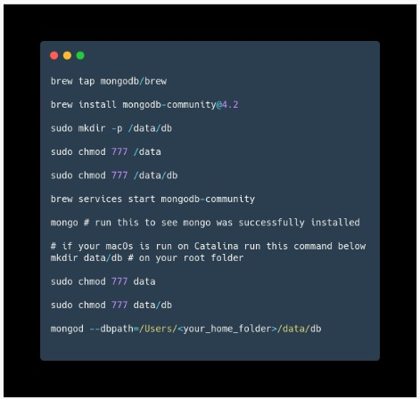

# <p style="text-align: center;">`Writing and Presentation Test Week 7 `</p>

---

## 1. Sequelize

### pengenalan sequelize

- Sequelize adalah ORM (Object Relational Mapping) Node JS yang berbasis promise. Sequelize mendukung sebagian besar relational Database seperti MySQL, PostgresQL, MariaDB, SQLite dan Miscrosoft SQL Server.

- Dengan fitur fitur di Sequelize, kita bisa mengelola dan mengatur data di database kita dengan cepat, dan efisien.

### ORM


- ORM adalah suatu metode/teknik pemrograman yang digunakan untuk mengkonversi data dari lingkungan bahasa pemrograman berorientasi objek (OOP) dengan lingkungan database relational.

### install sequelize

#### Sequelize-cli

- Kita perlu menginstall sequelize cli agar dapat menjalankan generator menggunakan terminal sehingga lebih mudah.

```command
npm i -g sequelize-cli
```

- Ketika kita melakukan inisiasi project kita pertama perlu menginstall sequelize menggunakan npm install sequelize dan perlu menginstall driver sql yang kita butuhkan

```
npm i --save sequelize
npm i --save mysql2
```

### Generate sequelize

#### Sequelize init

- Pertama kita perlu melakukan inisialisasi di project kita terlebih dahulu agar dapat melakukan generate code

```
npx sequelize-cli init
```

#### setting db


#### Generate model

- Mari kita membuat table todo dengan field seperti gambar di bawah

```
npx sequelize-cli model:generate --name Todo --attributes title:string,description:string,startTime:date,status:string
```

- Kita bisa melihat datanya menjadi sebuat class (OOP) dan dapat kita gunakan untuk membuat Rest API menggunakan express atau dapat memberikan behaviour di statenya


- Akhirnya kita dapat menggunakan generate dan kita bisa mengecek ke database sehingga dapat kita gunakan untuk penimpanan DB

```
npx sequelize-cli db:migrate
```

- Jika ada yang salah, kita bisa mengembalikan (undo) menggunakan :

```
npx sequelize-cli db:migrate:undo
```


- Ketika kita berhasil melakukan generate maka kita dapat melihat di database ada 1 table baru yang bernama Todos dan ada table SequelizeMete

#### Generate seed

- Seed adalah data awal yang bisa kita gunakan untuk mengisi data di database untuk keperluan awal project menggunakan sequelize

```
npx sequelize-cli seed:generate --name demo-todo
```


- Ketika sudah berhasil melakukan generate maka kita dapat melakukan pengisian data seed didalam file seed generator. Terdapat 2 data yang diisi yaitu “up” untuk mengisi data di db, dan “down” untuk drop atau menghapus semua data seed di db

- Kita kemudian menjalankan generate seed menggunakan sequelize

```
npx sequelize-cli db:seed:all
```

- Jika ada yang salah, kita bisa mengembalikan (undo) menggunakan

```
npx sequelize-cli db:seed:undo
```

- Ketika kita menjalankan generate seed menggunakan terminal, maka kita dapat melihat bahwa seeding kita sudah berhasil ter insert ke db.

### membuat CRUD dengan Express dan Sequelize

#### get all todo

- Untuk Kita akan membuat sebuah routing entuk get all todo dengan syntax berikut


- Ketika kita akses endpoint tersebut, maka akan menghasilkan result seperti ini :
  

#### get todo by id

- Untuk Kita akan membuat sebuah routing entuk get detail todo berdasarkan Id todo dengan syntax berikut


- Ketika kita akses endpoint tersebut, maka akan menghasilkan result seperti ini :


#### create new todo

- Untuk Kita akan membuat sebuah routing entuk create new todo dengan syntax berikut


- Ketika kita akses endpoint tersebut, maka akan menghasilkan result seperti ini :


#### update todo by id

- Untuk Kita akan membuat sebuah routing entuk update todo by Id dengan syntax berikut


- Ketika kita akses endpoint tersebut, maka akan menghasilkan result seperti ini :


#### delete todo

- Untuk Kita akan membuat sebuah routing entuk delete todo by Id dengan syntax berikut


- Ketika kita akses endpoint tersebut, maka akan menghasilkan result seperti ini :


## 2. postman

### Apa Itu Postman

- Postman adalah tools yang bisa digunakan untuk menguji sebuah API.
- Postman memiliki graphical user interface (GUI) sehingga dapat digunakan dan dipahami oleh backend developer.
- Postman bisa di download secara gratis dan dapat berjalan pada sistem operasi Windows, Linux, maupun macOS.

### Instalasi Postman

- Karena Postman tersedia dalam banyak platform OS (Windows, Linux, Mac), maka tiap OS punya cara instalasinya tersendiri
- Silakan ikuti instruksi, sesuai dengan sistem operasi yang Anda gunakan untuk install postman.
- https://learning.postman.com/docs/getting-started/installation-and-updates/

### Komponen UI Postman

- Mari kita berkenalan dengan komponen UI yang ada di dalam aplikasi Postman.
- Ada beberapa komponen UI basic yang harus kita pahami untuk memulai menggunakan Postman sebagai tool pengujian REST API.
- Beberapa Komponent tersebut, adalah sebagai berikut :
  - Request Tab
  - Method Path Request
  - HTTP Method Selector
  - Request Options
  - Response

### Komponen UI Postman : Request Tab


- Komponen ini merupakan tab dari halaman request.

- Sama seperti pada web browser, ketika membuka halaman browser baru, kita bisa membuka tab baru. Begitu juga dengan Postman, bila ingin membuat request baru, bisa dengan cara membuka tab baru.

### Komponen UI Postman : HTTP Method Selector


- Postman mendukung seluruh method yang ada di HTTP Request.
- Secara mudah kita bisa mengubah method yang digunakan dengan menekan opsi dropdown yang tersedia.

### Komponen UI Postman : Request Options


- Komponen ini digunakan untuk menyisipkan data dalam bentuk params URL, authorization, Headers, Body, dan lainnya.
- Kita dapat secara mudah menyisipkan data pada request melalui komponen ini.

### Komponen UI Postman : Response


- Ketika mengirimkankan request, maka response body akan ditampikan pada komponen ini.
- Response dari server akan ditampilkan secara terformat sesuai dengan Content-Type yang diberikan server.
- Jika responsnya HTML, ia akan di render layaknya pada browser. - Jika JSON, ia akan diformat dengan struktur JSON.

### Test REST API

- Pada kali ini, kita akan mulai melakukan pengujian REST API yang sudah kita kerjakan sebelumnya (CRUD Todo List) dengan menggunakan Postman.

- Kita akan melakukan pengujian terhadap method-method berikut :

  - Create New Todo
  - Get All Todo
  - Get Todo By Id
  - Update Todo By Id
  - Delete Todo By Id

- NOTE : Pastikan server sudah dalam kondisi aktif sebelum melakukan proses pengujian REST API dengan menggunakan Postman

#### Test REST API : Create New Todo

- Untuk create new todo, pada halaman request method menjadi POST. Kemudian isi request URL dengan url server, contoh http://localhost:3000/todos.


- Kemudian pilih tab Body untuk melakukan setting body request.


- Pilih option raw kemudian ganti format text menjadi JSON, kemudian input data body JSON, Seperti berikut


- klik send, dan kita akan menerima response dari server.


#### Test REST API : Get All Todos

- Untuk get all todos, Pada halaman request method pilih method GET. Kemudian isi request URL dengan url server, contoh http://localhost:3000/todos.


- Untuk get all todos, kita tidak perlu menambahkan request body, langsung saja klik send, dan kita akan menerima response dari server

- Untuk get all todos, kita tidak perlu menambahkan request body, langsung saja klik send, dan kita akan menerima response dari server


#### Test REST API : Update Todo By Id

- Untuk update todo by Id, pada halaman request method pilih method PATCH. Kemudian isi request URL dengan url server, contoh http://localhost:3000/todos/<id todo yang ingin di update>


- Kemudian pilih tab Body untuk melakukan setting body request.


- Pilih option raw kemudian ganti format text menjadi JSON, kemudian input data body JSON, Seperti berikut


- klik send, dan kita akan menerima response dari server.


#### Test REST API : Delete Todo By Id

- Untuk delete todo by Id, pada halaman request method pilih method DELETE. Kemudian isi request URL dengan url server, contoh http://localhost:3000/todos/<id todo yang ingin di hapus>.


- Untuk delete todo by id, kita tidak perlu menambahkan request body, langsung saja klik send, dan kita akan menerima response dari server


#### Postman Collection

- Postman collection adalah tempat menyimpan kumpulan-kumpulan request.
- Kita bisa menganggap collection adalah sebuah folder yang menyimpan berkas, namun berkas yang akan disimpan itu adalah request.
- Dengan adanya collection request bisa Anda kelompokkan sehingga lebih mudah untuk diakses.
- Berikut adalah contoh collection Todos API Test.
  

#### Postman Environment

- Postman Environment merupakan kumpulan dari variabel yang dapat digunakan pada request di Postman.
- Ketika menggunakan Postman, terkadang kita perlu menyimpan nilai pada sebuah variabel.
- Contohnya ketika melakukan pengujian REST API yang sama, namun berada di 2 server yang berbeda. Maka kita perlu membuat variabel enviroment agar collection kita bisa bersifat dinamis.
- Variabel tak hanya digunakan untuk kasus tersebut saja, melainkan dapat juga untuk menyimpan nilai token, auth-key, atau nilai lainnya yang dipakai selama proses uji.
- Berikut adalah tampilan environment pada Postman.


- Environment dapat digunakan pada collection atau spesifik request.


- Untuk menggunakan variabel environment pada request, bisa dituliskan nama variabel-nya yang dibungkus dengan kurung kurawal ganda, contoh: {{host}}

- Notasi tersebut dapat digunakan di request URL, parameters, headers, dan body data.


#### Publish API Documentation

- Postman secara otomatis akan membuat dokumentasi basic untuk setiap collection yang sudah kita buat.
- Kita Cukup melihat dokumentasi untuk mendapatkan detail semua request yang ada di dalam sebuah collection.
- Agar dokumentasi yang sudah di buat lebih bermanfaat bagi pengguna, kita bisa menambahkan deskripsi pada sebuah request di dalam collection.
- Agar dokumentasi yang sudah di buat lebih bermanfaat bagi pengguna, kita bisa menambahkan deskripsi pada sebuah request di dalam collection.


- Kita dapat membuat collection baru untuk menyimpan dan mengatur dokumentasi dari suatu REST API yang kita kerjakan.
- Secara default, dokumentasi ini akan bersifat private, jadi hanya orang yang sudah di berikan akses ke collection tersebut yang dapat melihatnya.
- Atau jika akan membuat API publik, kita bisa mempublikasikan dokumentasi agar tersedia secara publik bagi siapa saja.

#### Cara Membuat API Documentation Menggunakan Postman

- Buka Collection yang ingin di buat dokumentasinya, kemudian pilih View documentation


- Kemudian akan tampil halaman documentation


- Pada halaman documentation tersebut, kita bisa menambahkan deskripsi documentation, deskripsi pada setiap request.


- Selain itu kita juga bisa melihat detail dari sebuah request, seperti HTTP Method, url, request body, request header, dll.


- Kita bisa juga mempublish documentation agar bisa diakses oleh public


- Contoh Dokumentasi Publik : https://documenter.getpostman.com/view/18657345/UVJhEFRg

## Mongodb

- MongoDB adalah salah satu database open source NoSQL yang cukup populer digunakan.
- MongoDB sering dipakai untuk aplikasi berbasis Cloud, Big Data maupun Grid COmputing
- Jika SQL menyimpan data menggunakan relasi tabel, MongoDB menggunakan dokumen dengan format JSON

### NoSQL

- NoSQL adalah Not Only SQL
- Artinya kita bisa mengolah database dengan fleksibel dan tidak membutuhkan Query
- Akhirnya kita memiliki skalabilitas yang tinggi sesuai dengan perkembangan data kita.

#### Kelebihan

- Sistem tidak membutuhkan Tabel
- Tidak perlu menggunakan Tabel yang terstruktur
- By Default sudah menggunakan JSON(JavaScript Object Notation), sehingga memudahkan integrasi dengan JavaScript
- Performa lebih cepat dengan kemampuan menampung banyak data yang bervariasi

#### Kekurangan

- Tidak mendukung transaksi
- Masalah konsistensi data
- Menggunakan banyak memory
- Hanya bisa menampung maksimal 16MB disetiap document

### Anatomi komponen dari Database MongoDB


- Database adalah wadah untuk menyimpan berbagai macam Collection
- Collection adalah tempat kumpulan dari berbagai macam document, sehingga collection sering disamakan dengan tabel pada SQL
- Document adalah unit terkecil yang berada pada MongoDB

### Contoh data pada MongoDB


### Proses Instalasi MongoDB

- Untuk proses lengkap bisa kunjungi dokumentasi MongoDB.

- https://docs.mongodb.com/manual/administration/install-community

### Proses Instalasi pada Ubuntu


### Proses Instalasi pada Mac



### Command pada MongoDB

```
sudo service mongod start
sudo service mongod stop
sudo service mongod restart
```

### MongoDB GUI Tools

- Untuk mempermudah kita bisa menggunakan GUI Tools Official dari MongoDB yaitu MongoDB Compass

- Link untuk download MongoDB Compass

- https://www.mongodb.com/products/compass

### Operasi CRUD MongoDB

- Kita bisa mulai dengan menyalakan MongoDB, lalu kita bisa mengakses dengan mengetikan “mongo” pada terminal

Untuk melihat database yang aktif, bisa gunakan db pada MongoDB shell

```
db
```

Untuk melihat daftar database bisa menggunakan show dbs

```
show dbs
```

Untuk Database baru gunakan use

```
use <name db>
use music
```

Untuk menambahkan Collection baru kita bisa gunakan

```
db.createCollections(“artis”)
```

Untuk menambahkan data pada Collection kita bisa gunakan

```
db.artis.insert({
    nama: "Peterpan",
    genre: "pop"
})
```

Untuk melihat data kita gunakan

```
db.artis.find()
```

Untuk mengupdate data pada Collection kita bisa gunakan

```
db.artis.update({
'nama':'Peterpan'
},{
$set:{'nama':'Noah'}
})
```

Untuk mengupdate data pada Collection kita bisa gunakan

```
db.artis.remove({
'nama': ‘Noah’
})
```

